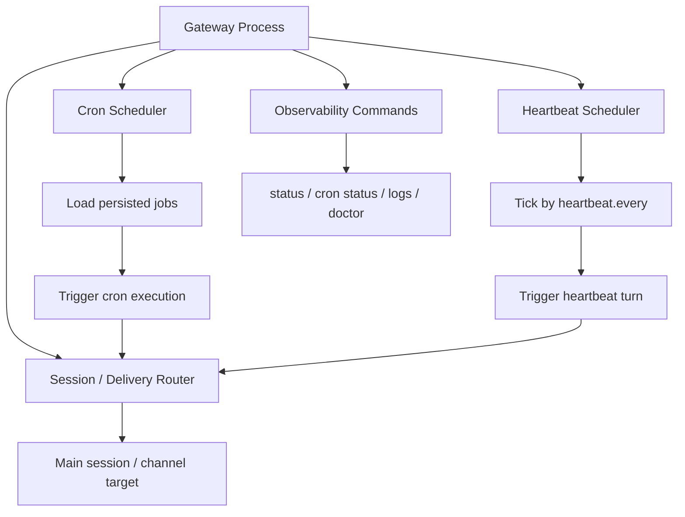
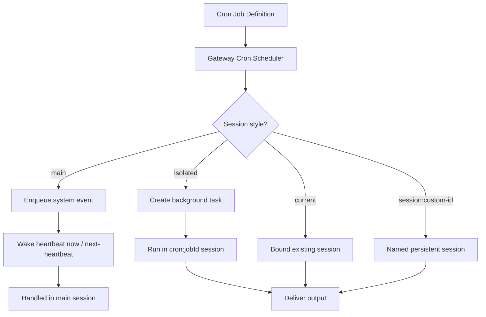
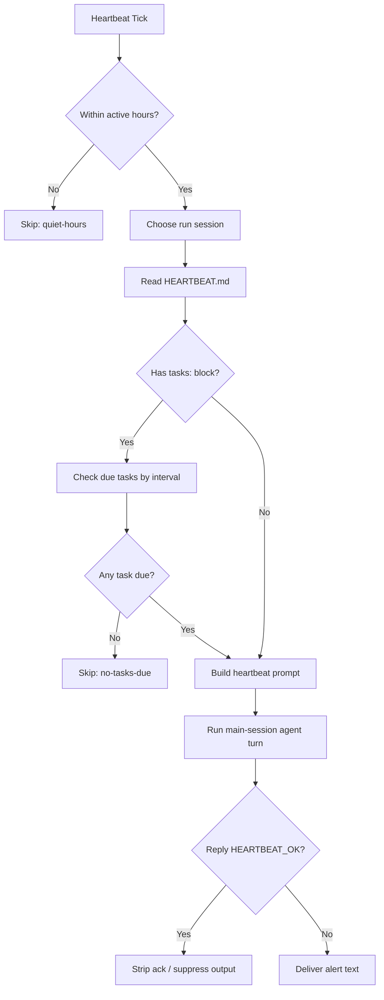
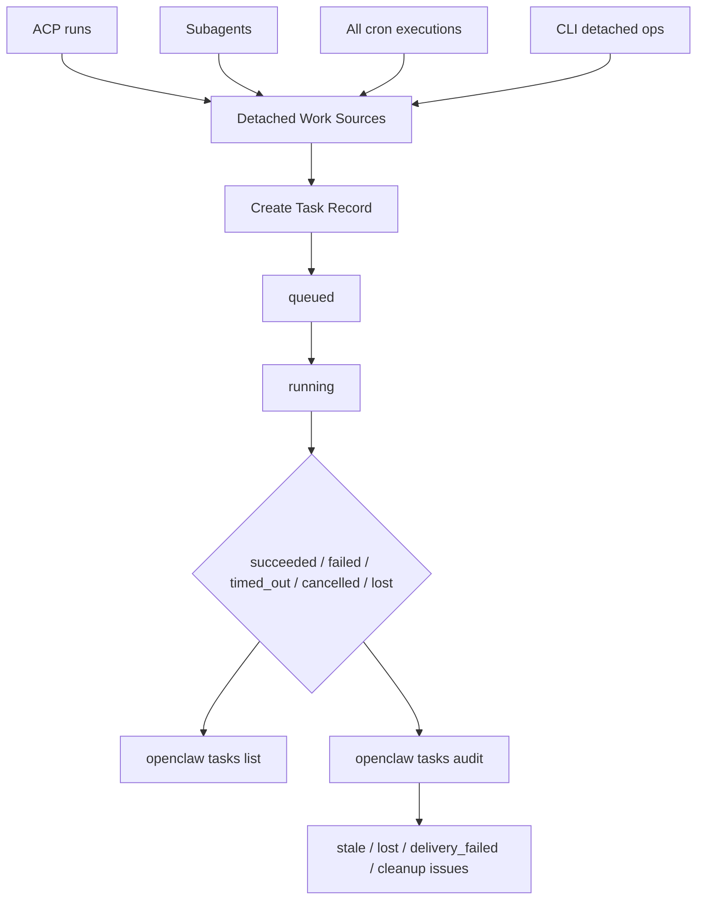
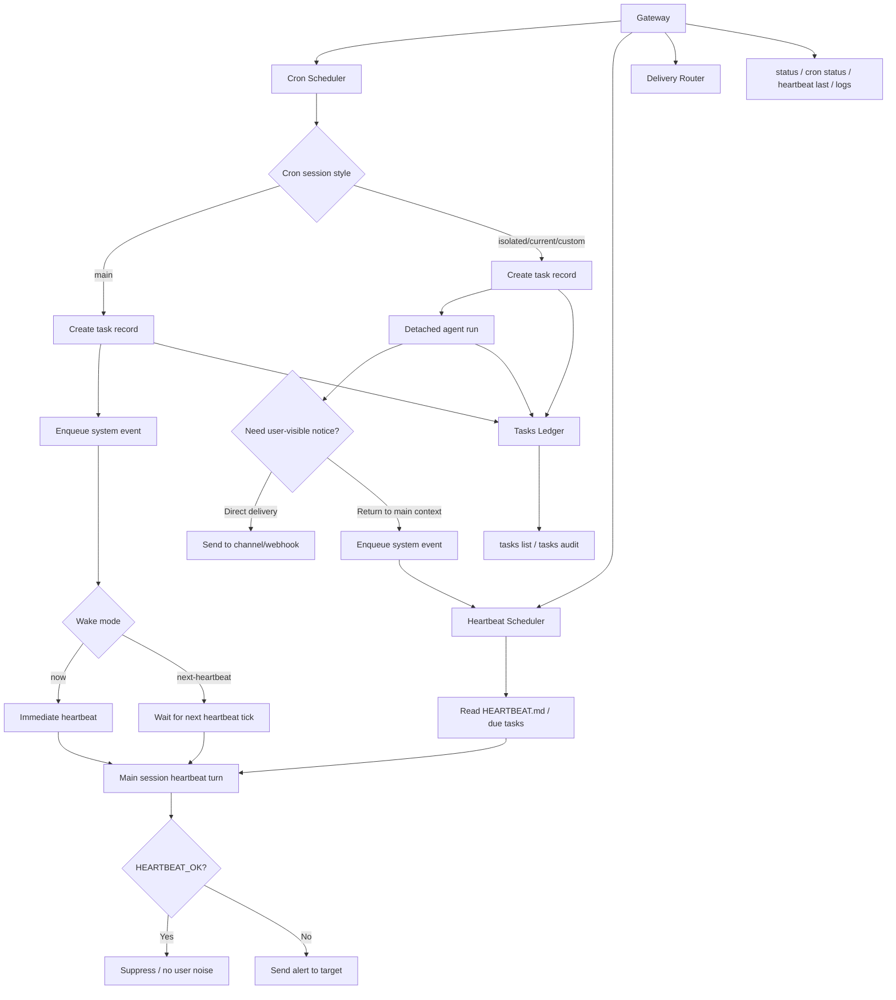
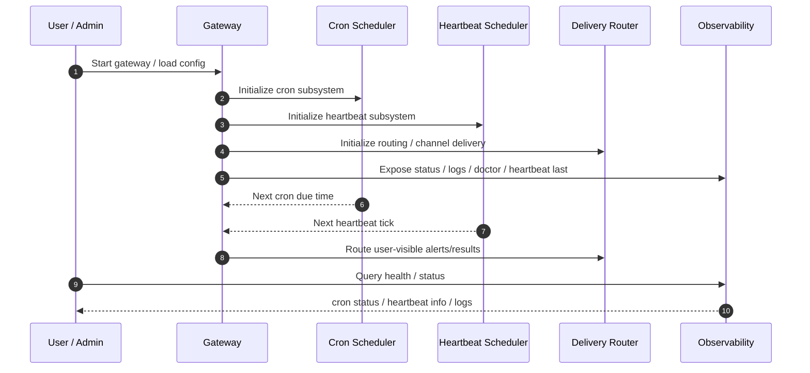
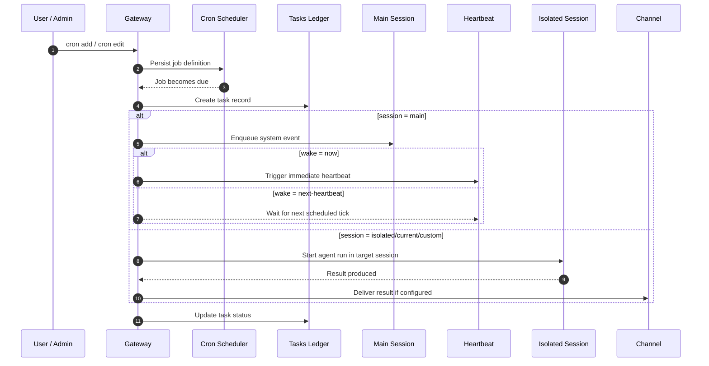
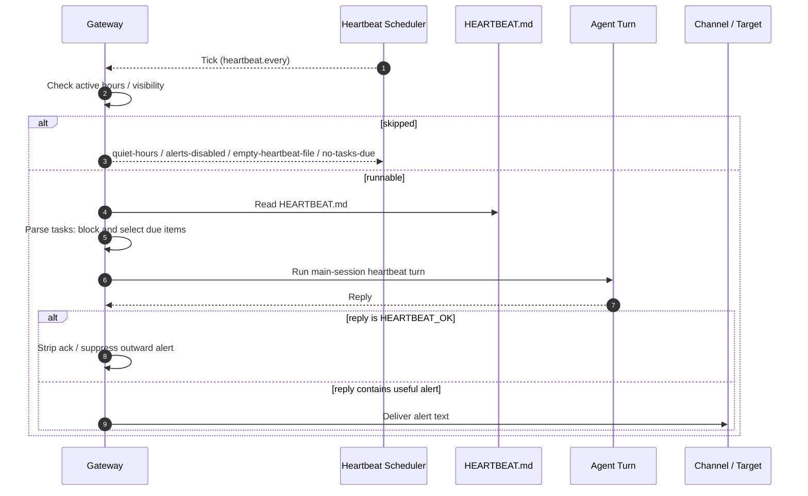
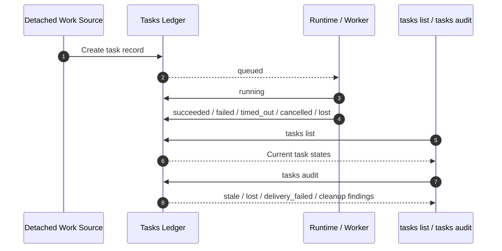
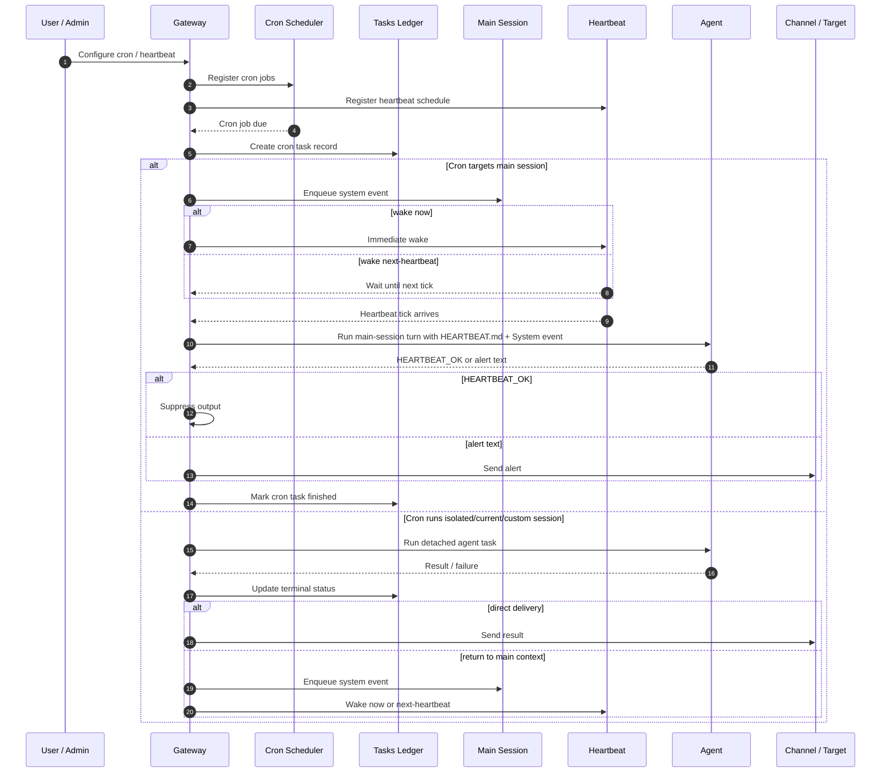

> From: https://chatgpt.com/c/69d3506c-ebf0-83e8-af77-f498204406e5

# you asked

讲讲openclaw中的心跳机制是啥？具体如何作用？

---

# chatgpt response

我先确认一下你说的 “openclaw” 指的是哪个项目，再结合源码或文档解释它的心跳机制和作用链路。若它是某个框架里的术语，我会尽量定位到具体实现而不是只讲概念。

已经定位到是 OpenClaw 的 Gateway Heartbeat。接下来我会把“它是什么”和“它在系统里怎样起作用”拆开讲，尽量结合官方文档和实现细节，而不是只给口语化比喻。

OpenClaw 里的 **Heartbeat（心跳）**，本质上不是“健康检查”，而是一个**周期性唤醒 Agent 的机制**：Gateway 会按间隔触发一次 **主会话里的 agent turn**，让模型主动看看“有没有什么该处理的事”，比如收件箱、日历、提醒、待办跟进。它和 cron 不一样：Heartbeat 是在**主会话上下文**里跑的，偏“上下文感知的巡检”；cron 则更适合“精确定时、独立执行”的任务。Heartbeat 默认大约每 30 分钟一次；在某些 Anthropic OAuth/token auth 场景下默认会是 1 小时。([OpenClaw](https://docs.openclaw.ai/gateway/heartbeat))
你可以把它理解成一句话：**Heartbeat = 定时把 AI 轻轻叫醒，让它自己巡逻一圈，但没事就别打扰你。** 官方文档明确说，它的目的就是“让模型能把需要关注的事浮出来，同时又不刷屏”；因此它虽然会定期运行，但**不会创建 background task 记录**，因为它不是脱离主会话的后台作业，而是一次计划好的主会话轮次。([OpenClaw](https://docs.openclaw.ai/gateway/heartbeat))
它具体怎么起作用，可以按这条链路看：

1. **到点触发**  
   你在配置里设 `heartbeat.every`，比如 `30m`。也可以配 `activeHours`，这样只有在指定时段内才运行；如果当前不在时间窗里，这次心跳会直接跳过，等下一个窗口内的 tick。([OpenClaw](https://docs.openclaw.ai/gateway/heartbeat))
2. **决定用什么上下文跑**  
   默认它在 agent 的 **main session** 里运行，也就是继承这个 agent 平时对话的上下文。这样好处是：它能结合你最近聊过的内容、最近的会话状态来判断什么值得提醒。若你担心 token 成本，可以开 `isolatedSession: true`，让每次心跳都在一个**全新的隔离会话**里跑；再配合 `lightContext: true`，就只保留轻量 bootstrap 上下文，主要把 `HEARTBEAT.md` 带进去。官方文档说，这样能把单次心跳的上下文成本从大约十万 token 量级压到几千 token。([OpenClaw](https://docs.openclaw.ai/gateway/heartbeat))
3. **向模型发一个专门的“心跳提示”**  
   默认 prompt 大意是：  
   “如果有 `HEARTBEAT.md` 就读它；严格按它来；不要从旧聊天里瞎推旧任务；如果没什么需要关注，就回复 `HEARTBEAT_OK`。”  
   这个 heartbeat prompt 会**原样作为 user message 发给模型**，同时系统提示里会带一个 Heartbeat 标记。也就是说，从模型视角看，它被明确告知：现在不是普通聊天，而是一次“巡检轮次”。([OpenClaw](https://docs.openclaw.ai/gateway/heartbeat))
4. **读取 `HEARTBEAT.md` / `tasks:`，决定这轮要不要干活**  
   如果工作区里有 `HEARTBEAT.md`，模型就会把它当作“巡检清单”。这个文件适合写成很小、很稳定的 checklist，比如“扫一眼收件箱”“看看今天会议有没有要准备的”。如果 `HEARTBEAT.md` 几乎是空的，OpenClaw 会直接跳过这轮，避免白白调用模型。([OpenClaw](https://docs.openclaw.ai/gateway/heartbeat))
5. **更细一点：`tasks:` 块会做“到期检查”**  
   `HEARTBEAT.md` 里还支持一个结构化的 `tasks:` 块。你可以给不同检查设不同周期，比如 inbox 每 30 分钟、calendar 每 2 小时。Heartbeat 到点后，OpenClaw 会先解析这些 task，看哪些 task **到期了**；只有到期的那几个才会被拼进这次 prompt。要是一个都没到期，这轮会直接以 `no-tasks-due` 跳过，不浪费一次模型调用。各 task 的上次运行时间会保存在 session state 的 `heartbeatTaskState` 里，所以普通重启后这些间隔信息还能延续。([OpenClaw](https://docs.openclaw.ai/gateway/heartbeat))
6. **模型给出结果：没事就 `HEARTBEAT_OK`，有事就发提醒文本**  
   这是这个机制最关键的一点。官方规定：如果没什么值得提醒，模型就回 `HEARTBEAT_OK`。OpenClaw 会把它当成一个 ack；当它出现在回复开头或结尾时，系统会剥掉这个 token，并且如果剩下内容不超过 `ackMaxChars`（默认 300），就把整条回复直接丢弃，不往外发。也就是说：**“心跳照常跑，但没事你看不到任何消息。”** 只有当模型真的产出需要提醒的内容时，才会发出来。([OpenClaw](https://docs.openclaw.ai/gateway/heartbeat))
7. **决定消息发到哪**  
   Heartbeat 的运行上下文和消息投递目标是两回事。它默认还是在 main session 中判断，但外发可以由 `target` 控制：  
   `none` 表示只运行、不外发；  
   `last` 表示发到这个 session 最近一次使用的外部渠道；  
   也可以显式指定 `telegram`、`whatsapp` 之类的 channel。  
   官方还特别说明：即便 `target` 没解析出外部目的地，这轮 heartbeat 也还是会跑，只是不会发消息。([OpenClaw](https://docs.openclaw.ai/gateway/heartbeat))
所以它真正的作用，不是“固定时间执行某个脚本”，而是让 OpenClaw 从**被动问答**变成**主动巡检**。比如你写了一个 `HEARTBEAT.md`：

```md
# Heartbeat checklist
- 看看有没有紧急未读邮件
- 看看接下来两小时有没有会议要准备
- 如果没有别的事，白天可以轻量问候一次
```

那么每次心跳到点，Agent 就会带着当前会话上下文和这份清单去想：  
“现在有没有紧急邮件？有没有临近会议？要不要提醒用户？”  
如果答案都是否，就回 `HEARTBEAT_OK`，这条消息会被吞掉；如果发现 20 分钟后有会，或者有封时间敏感的邮件，它才会真正 ping 你。这个设计正对应文档里的建议用法：**inbox 检查、calendar 监控、周期性提醒整合到一次上下文感知的巡检里**。([OpenClaw](https://docs.openclaw.ai/automation))
你也可以把它和 cron 的分工记成：

- **Heartbeat**：适合“隔一会儿巡逻一下，看看有没有值得提醒我的事”  
- **Cron**：适合“9:00 准时发日报”“20 分钟后提醒我”“每周一跑一次独立分析”([OpenClaw](https://docs.openclaw.ai/automation))
一句最实在的总结：

**OpenClaw 的心跳机制 = 定期触发一次“带上下文的主动思考”，再用 `HEARTBEAT_OK` 这层协议把“无事发生”静默掉，只把真正值得打扰你的内容送出来。** ([OpenClaw](https://docs.openclaw.ai/gateway/heartbeat))
你要是愿意，我下一条可以直接给你画一张 **“Heartbeat 从触发到提醒的执行流程图”**，或者顺手讲一下 **`HEARTBEAT.md` 怎么写才最实用**。

---

# you asked

Cron和HeartBeat二者在openclaw中是如何协作运行统一管理的？

---

# chatgpt response

我先把 OpenClaw 里 automation 的整体调度关系查清楚，重点看 Heartbeat、Cron、Task 在文档和实现里怎么分层，以及它们是不是共用同一套运行与状态管理。

我已经确认了一个关键点：OpenClaw 不是把 Cron 和 Heartbeat 当两套完全平行的系统，而是让 Cron 在某些模式下“借道” Heartbeat 进入主会话；真正统一管理它们的是 Gateway 调度层加上 tasks ledger。接下来我把这层关系讲清楚。

在 OpenClaw 里，**Cron 和 Heartbeat 不是两套互不相干的机制**，但也**不是完全被抽象成同一种对象**。更准确地说：它们都由 **Gateway 这一层统一调度**，但职责不同；**Cron 负责“精确定时”**，**Heartbeat 负责“主会话里的周期性唤醒”**。官方文档把两者放在同一套 Automation 体系里：Cron 适合日报、定点提醒、独立后台作业；Heartbeat 适合收件箱、日历、通知这类需要主会话上下文的巡检。([OpenClaw](https://docs.openclaw.ai/automation))
先说“统一管理”的**核心分工**。  
**Cron** 是 Gateway 内建的 scheduler，运行在 Gateway 进程里，任务定义会持久化到 `~/.openclaw/cron/jobs.json`，所以服务重启后调度不会丢。**Heartbeat** 也是 Gateway 管的，但它不是 job 列表式的精确定时器，而是按 `heartbeat.every` 周期触发一次 agent turn，默认在主会话里执行。也就是说，**两者的“时间控制权”都在 Gateway，区别只是一个偏精确 job 调度，一个偏上下文轮询唤醒。** ([OpenClaw](https://docs.openclaw.ai/automation/cron-jobs))
它们最典型的**协作点**是：**Cron 可以把工作“送进” Heartbeat。** 当你把 cron job 配成 `--session main` 时，它**不会直接开一个独立后台会话去跑**，而是给主会话**入队一个 system event**，然后可选地 `--wake now` 或 `--wake next-heartbeat` 去唤醒 Heartbeat。官方原话基本就是：**main session jobs enqueue a system event and optionally wake the heartbeat**。所以，很多“提醒我一下”“下次心跳时检查某事”这类需求，实际上是 **Cron 负责定时，Heartbeat 负责在主会话里消费和执行**。([OpenClaw](https://docs.openclaw.ai/automation/cron-jobs))
但这不是唯一模式。Cron 还有 `isolated`、`current`、`session:custom-id` 这些执行样式：  
`isolated` 会在专门的 `cron:<jobId>` 会话里独立运行，适合报告、后台处理；`current` 绑定创建时的当前会话；`session:custom-id` 则让一组定时任务长期积累自己的会话历史。也就是说，**只有“main session cron”会显式借助 Heartbeat 进入主会话链路**；其余 cron 运行可以完全绕开 Heartbeat，自己独立执行。([OpenClaw](https://docs.openclaw.ai/automation/cron-jobs))
再看“统一管理”的第二层：**任务与通知回流。** OpenClaw 有一套 **background tasks ledger** 记录脱离主会话的后台工作。这里要注意一个细节：**所有 cron 执行都会创建 task record，但 Heartbeat 不会。** 官方明确说：tasks 是记录器，不是调度器；cron 和 heartbeat 决定何时运行，tasks 负责追踪发生了什么。更关键的是，后台任务完成后有两条通知路径：要么**直接投递到频道**，要么**排队成 system event，等下一次 Heartbeat 表达出来**；并且任务完成时还会**立刻触发 heartbeat wake**，让你不用傻等下一个周期。换句话说，**Cron/子任务的结果，也能通过 Heartbeat 回到主会话。** ([OpenClaw](https://docs.openclaw.ai/automation/tasks))
再进一步，Heartbeat 自己内部也带一个“小型节流调度器”。`HEARTBEAT.md` 可以写普通 checklist，也可以写 `tasks:` 块；OpenClaw 会在每次 heartbeat tick 时检查这些 task 的 `interval`，**只把到期的检查项拼进本轮 prompt**，如果一个都没到期，就直接以 `reason=no-tasks-due` 跳过。这说明 Heartbeat 不是单纯固定频率盲跑，而是可以在自身内部做“到期筛选”。所以从架构上看，**Cron 负责外层精确定时，Heartbeat 负责内层上下文巡检与批处理。** ([OpenClaw](https://docs.openclaw.ai/gateway/heartbeat))
如果你问“那 OpenClaw 到底有没有一套统一入口来管它们”，答案是：**有，但不是一个单一表模型，而是“三层统一”**。  
第一层是 **Gateway 调度层**：Cron 和 Heartbeat 都由它驱动。  
第二层是 **Session/Event 层**：main-session cron 通过 system event + wake 接入 heartbeat 主会话。  
第三层是 **Tasks/Observability 层**：cron、subagent、ACP 等 detached work 进 tasks ledger，状态可通过 `openclaw tasks list` / `audit` 看；而 heartbeat 本身通过 `openclaw system heartbeat last`、`openclaw status`、`openclaw cron status`、`openclaw cron runs` 这套命令一起排障。官方 troubleshooting 也是把 cron 和 heartbeat 放在同一条诊断链路里排查。([OpenClaw](https://docs.openclaw.ai/automation/cron-jobs?utm_source=chatgpt.com))
所以你可以把它记成一句话：

**Cron 决定“什么时候触发某件事”，Heartbeat 决定“在主会话里怎么顺手把一批事一起想完、安静地说出来”；Gateway 统一调度，tasks ledger 统一追踪 detached work，system event + wake 负责把两者串起来。** ([OpenClaw](https://docs.openclaw.ai/automation))
如果你愿意，我下一条可以直接给你画一个 **“Cron → system event → Heartbeat → 用户提醒”** 的运行时序图。

---

# you asked

讲讲这一部分吧

---

# chatgpt response

我展开讲你圈的这块：重点不是“这些命令分别干啥”，而是 **OpenClaw 怎么把分散的自动化运行痕迹收拢成一条可排障链路**。 我会把 tasks ledger、heartbeat 观测、cron 观测三块连起来讲。

可以，这一层其实是在讲：**OpenClaw 把“自动化有没有跑、跑到哪了、为什么没通知出来”分成了两类可观测对象来看**——

- **Tasks ledger**：看“后台工作本身”的生命周期  
- **Cron / Heartbeat 观测**：看“调度器有没有触发、主会话有没有被唤醒、消息有没有送出来” ([OpenClaw](https://docs.openclaw.ai/automation/tasks))
### 1. Tasks ledger 到底是什么

Tasks 不是调度器，而是一本**后台工作流水账**。文档里说得很直接：它记录的是脱离主会话的工作，比如 ACP、subagent、所有 cron 执行、CLI 发起的 agent 操作；而普通聊天和 heartbeat turn **不会**生成 task record。也就是说，Heartbeat 更像“主会话里的一次巡检轮次”，Cron/ACP/subagent 才更像“可追踪的 detached work”。([OpenClaw](https://docs.openclaw.ai/automation/tasks))
它的状态流转也很清晰：  
`queued → running → terminal`，终态可能是 `succeeded`、`failed`、`timed_out`、`cancelled`、`lost`。所以当你怀疑“任务是不是卡住了”，先看 task 状态比看聊天记录可靠得多。([OpenClaw](https://docs.openclaw.ai/automation/tasks))
### 2. `openclaw tasks list` 在排查里是干嘛的

`openclaw tasks list` 相当于总账本视图。它默认按新到旧列出任务，还能按 runtime 或 status 过滤；输出列里会带 Task ID、Kind、Status、Delivery、Run ID、Child Session、Summary。你可以把它理解成：**先确认“有没有这笔任务”和“它现在在哪个阶段”**。([OpenClaw](https://docs.openclaw.ai/automation/tasks))
如果 `tasks list` 已经看到这次 cron 对应的 task 存在，而且状态是 `running`，那说明问题通常不在“有没有被调度到”，而在“执行卡住了”或“后续通知没送出去”；如果连 task 都没有，那就应该回头查 cron 调度链，而不是盯着 delivery。([OpenClaw](https://docs.openclaw.ai/automation/tasks))
### 3. `openclaw tasks audit` 为什么重要

`openclaw tasks audit` 不是列任务，而是做**健康诊断**。它会报一些典型异常，而且这些 findings 还会同步出现在 `openclaw status` 里。文档列出的触发条件很实用：

- `stale_queued`：排队超过 10 分钟  
- `stale_running`：运行超过 30 分钟  
- `lost`：底层 runtime ownership 消失了  
- `delivery_failed`：通知发送失败，且不是 silent  
- `missing_cleanup`：任务结束了但没有 cleanup 时间戳  
- `inconsistent_timestamps`：时间线前后矛盾 ([OpenClaw](https://docs.openclaw.ai/automation/tasks))
所以 `tasks audit` 的意义，不是“再看一遍 list”，而是帮你回答：**这条后台工作在系统语义上是不是已经坏掉了**。尤其是 `lost` 很关键，它表示“账本里还记着任务，但底层真正拥有它的运行时已经不在了”。([OpenClaw](https://docs.openclaw.ai/automation/tasks))
### 4. 它为什么叫 Observability 层

因为 OpenClaw 不鼓励你一直轮询。文档明确说 detached work 的完成通知是 **push-driven**：任务结束后，要么直接通知到 channel，要么去唤醒 requester session / heartbeat。也就是说，系统设计目标是“任务自己回报结果”，而不是让你不断 `show` 它。([OpenClaw](https://docs.openclaw.ai/automation/tasks))
这也解释了为什么 Heartbeat 会和 Tasks 放在同一条排障链路里：  
**Task 负责说明后台活干完没，Heartbeat 负责把某些结果带回主会话说给你听。** 如果 task 已经成功，但你没收到消息，那么问题可能不在执行，而在 delivery path 或 heartbeat wake。([OpenClaw](https://docs.openclaw.ai/automation/tasks))
### 5. `openclaw system heartbeat last` 在这里看什么

这个命令不是看 task，而是看**最近一次 heartbeat 事件**。system 文档里写得很清楚：`openclaw system heartbeat last` 用来显示上一次 heartbeat event；`system event` 则是往 main session 里塞一个 system event，下一个 heartbeat 会把它作为 `System:` 行注入 prompt，`--mode now` 可以立刻唤醒，`next-heartbeat` 则等下个 tick。([OpenClaw](https://docs.openclaw.ai/cli/system))
所以你可以把它当成“主会话调度侧的黑匣子”。比如：

- task 成功了，但 heartbeat last 显示最近一次被 skip 了  
- 或者最近一次 heartbeat 根本没跑到  
- 或者 system event 入队了，但还没被消费

这时你就知道问题在**主会话巡检链**，不是 task 执行链。([OpenClaw](https://docs.openclaw.ai/cli/system))
### 6. 为什么官方把这些命令放成一条“命令阶梯”

Cron 文档给出的 automation troubleshooting 顺序是：  
`openclaw status → openclaw gateway status → openclaw cron status → openclaw cron list → openclaw cron runs --id ... → openclaw system heartbeat last → openclaw logs --follow → openclaw doctor`。([OpenClaw](https://docs.openclaw.ai/automation/cron-jobs))
这条顺序其实对应一条**因果链**：

1. **系统活着吗**：`status` / `gateway status`  
2. **调度器开着吗**：`cron status`  
3. **这条 job 存在吗**：`cron list`  
4. **最近到底跑没跑、结果是 ok/skipped/error 吗**：`cron runs`  
5. **如果它依赖主会话表达，heartbeat 最近有没有跑/被跳过**：`system heartbeat last`  
6. **最后再看日志和 doctor**：做底层确认 ([OpenClaw](https://docs.openclaw.ai/automation/cron-jobs))
也就是说，这不是一串杂乱命令，而是从“全局健康”一路缩小到“具体这一跳出了什么问题”的排查路径。([OpenClaw](https://docs.openclaw.ai/automation/cron-jobs))
### 7. Heartbeat 常见“没动静”其实不是坏了，而是被判定为 skip

在 gateway troubleshooting 里，官方专门列了 cron 和 heartbeat delivery 的排查点：  
看 cron 是否 enabled、有没有 next wake、job run history 是 `ok / skipped / error`，以及 heartbeat 的 skip reason，比如 `quiet-hours`、`requests-in-flight`、`alerts-disabled`、`empty-heartbeat-file`、`no-tasks-due`。([OpenClaw](https://docs.openclaw.ai/gateway/troubleshooting))
这点很重要，因为很多人会把“没收到提醒”误判成“Heartbeat 挂了”。其实有可能只是：

- 不在 active hours，所以 `quiet-hours`
- `HEARTBEAT.md` 空了，所以 `empty-heartbeat-file`
- `tasks:` 里没有任务到期，所以 `no-tasks-due`

这时 `system heartbeat last` 比 `tasks list` 更能解释“为什么安静”。([OpenClaw](https://docs.openclaw.ai/gateway/troubleshooting))
### 8. 你可以把这层理解成一句话

**Tasks 负责记账，Cron 负责定时，Heartbeat 负责在主会话里表达；Observability 层就是把这三件事串起来，让你知道“是没调度、没执行、没清理，还是执行了但没送达”。** Tasks 还带了 7 天保留与自动清理；`maintenance` 会做 reconciliation、cleanup stamping、pruning，cron task 会检查 cron runtime 是否还拥有该 job。([OpenClaw](https://docs.openclaw.ai/automation/tasks))
如果你愿意，我下一条可以直接给你举一个 **“cron runs 显示 ok，但用户没收到消息”** 的完整排障例子，把这套链路串成一个真实场景。

---

# you asked

画一个这四者各自的mermaid，以及一个统一协作的总体mermaid

---

# chatgpt response

我按最核心的四个角色来画：**Gateway 调度层、Cron、Heartbeat、Tasks Ledger**。再补一张把 **system event / delivery / 主会话** 串起来的总图，便于你直接对照源码或文档理解。

可以。我这里把“四者”定成 **Gateway 调度层、Cron、Heartbeat、Tasks Ledger** 来画；最后再给你一张把 **system event、主会话、delivery** 串起来的总体图。这样最贴近 OpenClaw 文档里的职责划分：Gateway 统一调度；Cron 做精确定时；Heartbeat 做主会话周期唤醒；Tasks Ledger 只负责追踪 detached work，不负责调度。([OpenClaw](https://docs.openclaw.ai/automation))
## 1) Gateway 调度层



这张图强调的是：**Cron 和 Heartbeat 都跑在 Gateway 里**。Cron 是 Gateway 内建 scheduler，job 会持久化；Heartbeat 也是 Gateway 侧周期触发，而不是模型自己“记得要跑”。([OpenClaw](https://docs.openclaw.ai/automation/cron-jobs))
---

## 2) Cron



Cron 的核心不是“主会话里直接说一句话”，而是**按精确时间触发一个 job**。当 `--session main` 时，它会**先入队 system event，再选择是否立刻唤醒 heartbeat**；而 `isolated/current/custom` 这些模式则更像独立执行路径。并且 **所有 cron 执行都会创建 task record**。([OpenClaw](https://docs.openclaw.ai/automation/cron-jobs))
---

## 3) Heartbeat



Heartbeat 是 **主会话里的周期性 agent turn**，默认约每 30 分钟一次；它**不创建 task record**。它会读 `HEARTBEAT.md`，若其中有 `tasks:` 块，就只把本轮到期的检查项放进 prompt；若模型回 `HEARTBEAT_OK`，OpenClaw 会把它当成 ack，通常直接静默吞掉。([OpenClaw](https://docs.openclaw.ai/gateway/heartbeat))
---

## 4) Tasks Ledger



Tasks Ledger 只是**账本**，不是调度器。它记录 ACP、subagent、所有 cron、CLI detached work 的生命周期，状态流转是 `queued → running → terminal`；Heartbeat turn **不进这本账**。`tasks list` 用来查“有没有这笔活”，`tasks audit` 用来查“这笔活有没有坏掉”。([OpenClaw](https://docs.openclaw.ai/automation/tasks))
---

## 5) 统一协作总图



这张总图对应的是 OpenClaw 的真实协作关系：

- **Gateway** 统一驱动 Cron 和 Heartbeat。([OpenClaw](https://docs.openclaw.ai/automation))- **Main-session cron** 不直接在主会话里“硬跑”，而是 **task record + system event + wake heartbeat**。([OpenClaw](https://docs.openclaw.ai/automation/cron-jobs))- **Detached work** 会进入 **Tasks Ledger**，供 `tasks list` / `tasks audit` 观测。([OpenClaw](https://docs.openclaw.ai/automation/tasks))- **Heartbeat** 最终负责把“需要主会话感知的事”批量表达出来；没事就 `HEARTBEAT_OK` 静默。([OpenClaw](https://docs.openclaw.ai/gateway/heartbeat))
你直接拿去做笔记的话，我建议记成一句：

**Cron 负责“准时触发”，Tasks Ledger 负责“全程记账”，Heartbeat 负责“在主会话里有分寸地说出来”，Gateway 负责“把这三件事拧成一套系统”。** ([OpenClaw](https://docs.openclaw.ai/automation))
下一条我可以把这五张再改成 **sequenceDiagram 时序图版**，那样更适合看“谁先调用谁”。

---

# you asked

好啊，你绘制一下

---

# chatgpt response

我把它改成更适合看“调用顺序”的 **sequenceDiagram 时序图**。会分别画单独时序，再给一张总协同时序，你可以直接贴到 Mermaid 渲染器里看。

下面是 **sequenceDiagram 版**。我按 **Gateway、Cron、Heartbeat、Tasks Ledger** 各画一张，再补一张 **统一协作总时序图**。这些图对应的是官方文档里的关系：Gateway 统一调度；Cron 负责精确定时；Heartbeat 负责主会话里的周期巡检；Tasks Ledger 只记录 detached work，Heartbeat turn 本身不创建 task record。([OpenClaw](https://docs.openclaw.ai/automation/cron-jobs?utm_source=chatgpt.com))
## 1) Gateway 调度层



这张图强调的是：**Gateway 是统一入口**，Cron 和 Heartbeat 都由它驱动，观测命令也围绕 Gateway 展开。([OpenClaw](https://docs.openclaw.ai/cli?utm_source=chatgpt.com))
## 2) Cron



这里最关键的是：**main-session cron 不是直接在主会话里硬执行，而是先入队 system event，再按 `now` 或 `next-heartbeat` 唤醒 Heartbeat；而所有 cron 执行都会创建 task record。** ([OpenClaw](https://docs.openclaw.ai/automation/cron-jobs?utm_source=chatgpt.com))
## 3) Heartbeat



这张图体现的是：Heartbeat 是**主会话里的周期性 turn**；它会读 `HEARTBEAT.md`，只把到期任务放进本轮 prompt；若回复是 `HEARTBEAT_OK`，通常会被静默吞掉。([OpenClaw](https://docs.openclaw.ai/gateway/heartbeat?utm_source=chatgpt.com))
## 4) Tasks Ledger



Tasks Ledger 是**记账层，不是调度层**。它覆盖 cron、ACP、subagent 等 detached work；Heartbeat main-session turn 不进入这本账。([OpenClaw](https://docs.openclaw.ai/automation/tasks?utm_source=chatgpt.com))
## 5) 统一协作总时序图



总图里最值得记的一句话是：**Gateway 统一调度；Cron 负责“什么时候触发”；Tasks Ledger 负责“全过程记账”；Heartbeat 负责“在主会话里把该说的话说出来，没事就安静”。** Detached task 完成后，也可以通过 system event + wake 回流到 Heartbeat，再由主会话表达给用户。([OpenClaw](https://docs.openclaw.ai/automation/cron-jobs?utm_source=chatgpt.com))
你要的话，我下一条可以把这 5 张再整理成一份 **更适合考试/面试背诵的极简版**。