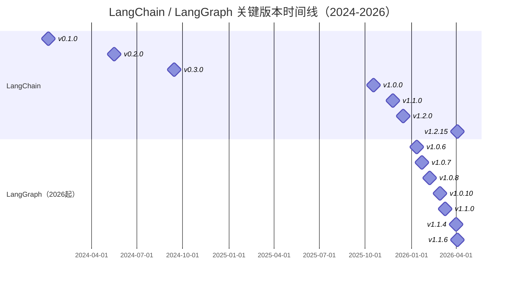
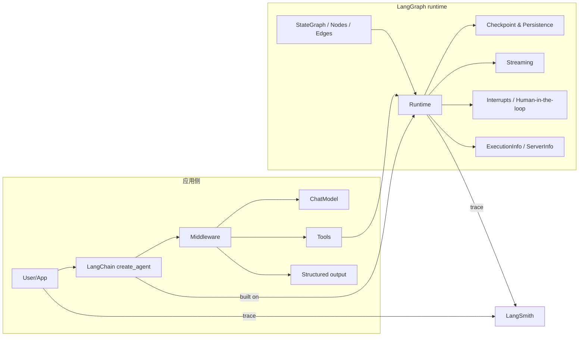
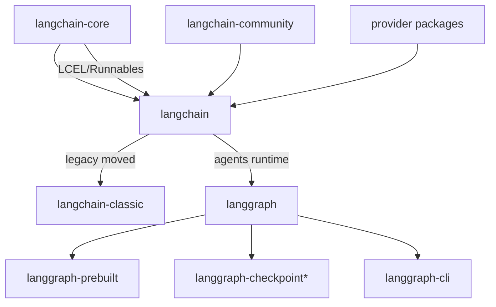

# LangChain 0.x → 最新版新特性演进与 LangGraph 2026 以来新特性研究报告

## 执行摘要

本次检索显示，LangChain 从 0.x 走向 1.x 的“主线变化”不是单点功能叠加，而是围绕**稳定性（版本/架构/弃用治理）**与**Agent 生产化能力（可控循环、持久化、可观测性、合规中间层）**的系统重构：0.1 以“拆包 + 新版本规则”奠定基础，0.2 强化稳定/安全并把 Agent 推荐路线转向 LangGraph，0.3 完成 Python 生态的 **Pydantic 2** 迁移与运行时基线升级，1.0 则以 **create_agent + middleware + content blocks + langchain-classic** 为核心，明确 1.x 期间不再引入破坏性变更并收敛包表面积（surface area）。citeturn5view1turn5view0turn5view2turn5view3turn4view2turn4view0

在 1.x 内部，1.1 聚焦“**模型能力自描述（model profiles）+ 更强中间层（summarization/retry/moderation 等）**”，1.2 聚焦“**跨厂商工具与结构化输出的一致性**”（tools extras、严格 schema、内置工具能力适配）。近期补丁版本（2026Q1–Q2）则呈现两条并行脉络：一是性能/可靠性（如初始化性能、递归限制等），二是安全治理（依赖 CVE 升级、以及 langchain-core 路径穿越类漏洞修复与遗留 API 的“安全降级”策略）。citeturn14view2turn7search4turn28search1turn28search2turn7search18

LangGraph 在 2026-01-01 以来的迭代重点更偏“**运行时工程化**”：2026 年初多为默认值/边界条件修复（递归限制、命名空间跳转、checkpointer 校验等），3 月的 1.1.0 引入可选的 **version="v2"**，把 streaming 与 invoke 的输出形状做成“可判别联合类型（discriminated union）”，显著提升类型安全与可维护性；3–4 月则补齐“运行时执行信息（ExecutionInfo/ServerInfo）”与部署/平台能力（deploy 远端构建），并强化与 entity["organization","LangSmith","llm observability platform"] 的互操作元数据，形成更可观测、更易部署的生产闭环。citeturn2view0turn33view0turn19view0turn8search3turn13view0turn10view0turn11view5

## 版本时间线

下表选取“关键版本”（不穷举所有 patch），发布日期优先以 PyPI/GitHub release/tag 上线时间为准；若官方公告日期不同，会在说明中标注。LangGraph 部分按用户要求覆盖 2026-01-01 起所有官方版本号（1.0.6 起）。citeturn27view0turn31view0turn31view1turn31view2turn2view0turn16view0

### LangChain 0.1 → 1.2.x 关键版本表

| 版本（Python） | 发布日期 | 新增特性与改动（摘要） | 破坏性变更/弃用 | 性能/安全与 API 迁移要点（含简短示例） |
|---|---:|---|---|---|
| 0.1.0 | 2024-01-06 | 明确新的版本规范（“破坏性变更→minor”）；延续“拆包架构”：`langchain-core`（核心抽象/LCEL）、`langchain-community`（第三方集成）与主包分层；并正式引入 LangGraph 作为更灵活的 Agent 循环/图式编排方案。citeturn31view0turn5view0turn5view1 | 目标是“可控弃用/减肥”，但此版本声明保持向后兼容。citeturn5view0 | **迁移要点**：开始为“集成依赖”与“核心抽象”分离做准备。示例：`pip install langchain-core langchain-community`（按需）并逐步把第三方集成导入迁往 `langchain_community.*`。citeturn5view1turn5view0 |
| 0.2.0 | 2024-05-17（公告 05-20） | `langchain` 与 `langchain-community` 解耦以提升稳定性与安全；引入版本化文档；推荐用 LangGraph 构建 agent（支持循环与内置 memory 的更可控方式）；同时强化标准聊天模型能力（工具调用标准化、结构化输出接口）、异步支持与新的事件流式 API。citeturn31view1turn5view2turn25search15 | 迁移重点在**导入路径与依赖显式化**：文档/loader/embeddings 等逐步迁往 community 或 provider 包。citeturn5view2 | **示例**：`from langchain_community.document_loaders import TextLoader`（替代旧 `langchain.document_loaders`）。迁移策略建议“先跑测试→再批量改导入→消除弃用告警”。citeturn5view2turn24search3turn25search13 |
| 0.3.0 | 2024-09-13（公告 09-17） | Python 全面迁移到 **Pydantic 2**；更多集成模块化到独立包；工具定义更简化；新增 chat model 工具（修剪/过滤/合并 message）与自定义事件派发。citeturn31view2turn5view3 | **破坏性**：不再支持 Pydantic 1；结束 Python 3.8。JS 侧：`@langchain/core` 变为 peer dependency、callbacks 默认非阻塞、移除旧入口点。citeturn5view3turn5view4 | **迁移要点**：移除 `langchain_core.pydantic_v1`/`pydantic.v1` 桥接用法，统一到 Pydantic 2；清理依赖树与版本 pin。citeturn5view4 |
| 1.0.0 | 2025-10-17（GA 公告 10-22） | 首个稳定大版本：承诺 2.0 前不引入破坏性变更；核心交付为 **create_agent（基于 LangGraph runtime）**、**middleware 系统**、主循环内置的结构化输出（减少额外 LLM 调用）、以及跨厂商的 content blocks 规范；并将遗留能力迁往 `langchain-classic` 以收敛主包命名空间。citeturn31view0turn4view2turn4view0 | 删除此前已标记弃用、计划在 1.0 移除的 API；并将大量旧 chains/retrievers/indexing/hub 等迁往 `langchain-classic`。citeturn6search7turn4view0 | **运行时基线**：要求 Python ≥3.10（迁移指南明确弃用 3.9）。示例（新标准）：`from langchain.agents import create_agent` + `agent.invoke({"messages":[...]})`。若依赖旧模块，需 `pip install langchain-classic` 并改导入：`from langchain_classic.chains import ...`。citeturn7search7turn4view0turn27view0 |
| 1.1.0 | 2025-11-25（公告 12-02） | 引入 **model profiles**（`chat_model.profile`，数据来自 models.dev）；summarization middleware 更“上下文感知”；结构化输出可从 profile 推断 provider-native 支持；`create_agent` 支持直接传 `SystemMessage`；新增 model retry middleware 与 OpenAI 内容审核 middleware。citeturn14view2turn6search2 | 多为增强型新增，按 semver 不应破坏主 API；弃用治理延续 1.x 范式。citeturn7search18 | **迁移要点**：把“动态模型选择/重试/审核/摘要压缩”等逻辑从业务层下沉到 middleware；减少散落的 try/except 与手写 guardrails。citeturn14view2turn8search23 |
| 1.2.0 | 2025-12-15 | `create_agent` 增强：通过 tools 的 `extras` 承载 provider-specific 工具参数与定义（含“provider 内置工具/客户端执行内置工具”等）；结构化输出支持严格 schema adherence（`response_format` 相关）。citeturn14view2turn7search9 | 侧重兼容性扩展；对“工具/结构化输出”的接口边界更清晰。citeturn14view2turn7search19 | **示例**：在工具绑定层启用严格 schema：`llm.bind_tools([...], strict=True)`（用于嵌套 schema 遵循）。citeturn7search10 |
| 1.2.14 / 1.2.15（最新） | 2026-03-31 / 2026-04-03 | 聚焦工程化：初始化性能优化（如 init speed 提升）、create_agent 递归限制与运行时可靠性修正、依赖升级。citeturn7search4turn27view0turn6search6 | 无新破坏性变更（semver 约束）；但建议关注依赖与安全补丁带来的行为差异。citeturn7search18 | **安全**：`langchain-core` 需关注路径穿越类漏洞（<1.2.22 受影响，建议升级）；并对 Pygments 等依赖做 CVE 升级。citeturn28search2turn28search6turn7search4 |

### LangGraph 2026-01-01 起所有官方发布版本表

> 注：下表版本号与日期由 PyPI release history 与 GitHub release/tag 对齐；对未在 release notes 中展开的条目按要求标注“未公开/未找到”。citeturn2view0turn16view0turn33view0turn34view0turn34view2

| 版本 | 发布日期 | 新增特性/改动（摘要） | 破坏性/弃用 | 迁移要点与示例 |
|---|---:|---|---|---|
| 1.0.6 | 2026-01-12 | 修复与默认值：BaseCache 默认翻转、默认递归限制调整、深层 graph jump 的命名空间 sanitize、checkpointer 类型编译期校验等。citeturn2view0turn33view0 | 未在条目中声明破坏性。citeturn33view0 | 建议：若依赖递归限制/缓存默认行为，升级后做回归（长链路与循环图）。citeturn33view0 |
| 1.0.7 | 2026-01-22 | 集中修复：适配 `aiosqlite` breaking change、依赖升级等。citeturn2view0turn34view0 | 未找到额外弃用说明。citeturn34view0 | 若使用 SQLite checkpointer/相关生态，升级后重点跑持久化与恢复用例。citeturn34view0 |
| 1.0.8 | 2026-02-06 | 修复与文档增强：含 “pydantic messages double streaming” 修复、运行时类描述补强等。citeturn2view0turn34view2 | 未找到额外弃用说明。citeturn34view2 | 若依赖 streaming 的消息形态（尤其与 Pydantic message 结合），需做端到端流式回归。citeturn34view2 |
| 1.0.9 | 2026-02-19 | GitHub tag 显示为 “langgraph + prebuilt” 联合发布；细项未在本次检索中展开。citeturn2view0turn20view0 | 未公开/未找到。citeturn20view0 | 建议按版本锁定（langgraph 与 prebuilt 一致），并做预置 agent 行为回归。citeturn20view0 |
| 1.0.10 | 2026-02-27 | Tag 显示发布；细项未在本次检索中展开。citeturn2view0turn19view0 | 未公开/未找到。citeturn19view0 | 若从 1.0.9 升级，建议做 checkpoint/SDK/CLI 组合矩阵测试（见 tags 同期多包发布）。citeturn19view0turn16view0 |
| 1.1.0 | 2026-03-10 | **Type-safe streaming & invoke（可选 version="v2"）**：统一 `stream()` 输出为 `StreamPart`（含 `type/ns/data`），`invoke()` 返回 `GraphOutput(value, interrupts)`；并支持 Pydantic/dataclass 输出 coercion；默认 v1 保持不变，旧式 dict 访问在 v2 下被标记弃用并给出迁移路径。citeturn2view0turn19view0turn8search3 | 引入 v2 的同时强调“默认不变”；但 v2 下对旧式访问给出弃用告警与未来移除时间表。citeturn19view0 | **示例**：`result = graph.invoke({...}, version="v2"); result.value; result.interrupts`。citeturn19view0turn8search3 |
| 1.1.1 | 2026-03-11 | 发布存在但细项未在本次检索中展开。citeturn2view0turn18view0 | 未公开/未找到。citeturn18view0 | 与 1.1.0 同期：建议把 v2 采用做成“按调用点逐步启用”的迁移策略。citeturn19view0 |
| 1.1.2 | 2026-03-12 | 发布存在但细项未在本次检索中展开。citeturn2view0turn18view0 | 未公开/未找到。citeturn18view0 | 同上。citeturn19view0 |
| 1.1.3 | 2026-03-18 | 引入/增强执行信息：release 列表包含 “add execution info to runtime” 等；并有 checkpoint-postgres 同期发布。citeturn2view0turn8search2 | 未公开/未找到。citeturn8search2 | 若做观测/审计，建议将 run_id/thread_id 等纳入 trace 维度。citeturn8search2turn13view0 |
| 1.1.4 | 2026-03-31 | 运行时细节修复与可观测性：避免递归限制默认值碰撞；新增与 entity["organization","LangSmith","llm observability platform"] 的集成元数据；依赖升级。citeturn2view0turn8search2turn11view5 | 未公开/未找到。citeturn8search2 | 若已有自定义 trace metadata，注意 `ls_integration` 不覆盖既有值的策略。citeturn11view5 |
| 1.1.5 | 2026-04-03 | 两条主线：其一是 runtime 暴露更丰富执行上下文（ExecutionInfo/ServerInfo、向 ToolRuntime 转发）；其二是 CLI 支持 `langgraph deploy` 的远端构建。citeturn2view0turn8search2turn13view0turn10view0 | 未公开/未找到。citeturn8search2 | 若在平台/分布式环境运行，建议用 execution_info/server_info 强化“可复现性 + 审计链”。citeturn13view0 |
| 1.1.6 | 2026-04-03 | 修复 execution info 在分布式 runtime 下为 None 的问题：通过惰性构造确保 runtime.execution_info 可用。citeturn2view0turn8search2turn11view1 | 未公开/未找到。citeturn11view1 | 对依赖 execution_info 的中间层/工具，建议升级到包含该修复的版本并做平台端回归。citeturn11view1 |

### 时间线图示建议（Mermaid）



上述里程碑日期来自 PyPI release history 与 GitHub tags/releases。citeturn31view0turn31view1turn31view2turn2view0turn16view0

## LangChain 重要特性深度解析

### 链与可组合性：LCEL/Runnables 取代“堆叠式 Chains”的范式转移

0.1 架构调整中最具长期影响的一点，是将“核心抽象”收敛到 `langchain-core`，并将 **LCEL（LangChain Expression Language）**作为组合胶水：LCEL 以 `Runnable` 为统一工作单元，强调“一次实现→同步/异步/批处理/流式自动具备”，并以 `RunnableSequence`、`RunnableParallel` 等原语表达线性与并行流水线。citeturn5view1turn30search4turn30search2

一个典型迁移方向，是把旧式“Chain 类层层嵌套”收敛为“可组合 Runnable 图”，以便更自然地获得并发、流式与统一事件观测能力（这也是 0.2 强调 Event Streaming API 的底层支点之一）。citeturn5view2turn25search4turn30search4

```python
# LCEL 风格（示意：prompt | model | parser 组合后自动具备 invoke/ainvoke/stream 等能力）
chain = prompt | model | output_parser
result = chain.invoke({"input": "hello"})
```

LCEL/Runnable 的“自动获得 sync/async/batch/streaming”与组合原语来源于官方 Runnable 参考说明。citeturn30search4

### Agent：从 AgentExecutor → LangGraph 推荐 → create_agent + Middleware 的主线整合

0.1 仍强调 AgentExecutor 是当时“跑 loop 的主要入口”，但同时发布 LangGraph 作为“用图描述 agent loop”的新库。citeturn5view0 0.2 进一步把 LangGraph 提升为推荐 agent 方式，原因在于它更易表达循环/条件跳转，并把 memory/状态持久化纳入一等公民（从而更接近生产需求）。citeturn5view2turn25search14

到 1.0，LangChain 把“快速上手 + 可定制”收敛为一个高层入口 **create_agent**，并明确其底座就是 LangGraph runtime，用来提供 durable execution、streaming、人类介入、持久化等能力。citeturn4view2turn4view0turn29view1turn27view0 这也使 LangGraph 的 `create_react_agent`（prebuilt）在 v1 被明确弃用，推荐迁移到 LangChain 的 `create_agent`。citeturn29view1turn29view0

```python
from langchain.agents import create_agent

agent = create_agent(model="...", tools=[...], system_prompt="...")
out = agent.invoke({"messages": [{"role": "user", "content": "..." }]})
```

`create_agent` 的定位、基于 LangGraph、以及“用 middleware 提升可定制性”的阐述来自 v1 发布说明与官方 release notes。citeturn4view0turn4view2turn29view1

### Middleware：把“上下文工程/安全/可靠性”产品化成可组合中间层

1.0 把 middleware 定位为“定义性特性”，用于在 agent loop 的关键点插入：动态 prompt、摘要压缩、工具访问控制、状态管理、guardrails 等。官方同时提供 human-in-the-loop、summarization、PII redaction 等内置 middleware，并允许用户自定义。citeturn4view0turn4view2turn8search23

1.1–1.2 的新增能力进一步体现了 middleware 化策略：摘要压缩可以根据 model profile 与 context overflow 自动触发；模型失败重试、内容审核等“横切关注点”也以 middleware 形式进入主干 API，而不是让业务层手写分散逻辑。citeturn14view2turn8search23

### 工具与结构化输出：跨厂商一致性从“接口”走向“能力感知 + 严格约束”

0.2 强调“标准化 tool calling 与结构化输出接口”，为后续 create_agent 的统一主循环打基础。citeturn5view2turn7search19 1.0 进一步把结构化输出集成到 agent 主循环，减少额外 LLM 调用带来的延迟与成本，并允许在“tool calling”与“provider-native structured output”间选择策略。citeturn4view2turn7search19

1.2 的重要增量在于把“工具的 provider-specific 差异”显式建模：通过 tools 的 `extras` 承载不同厂商工具参数、内置工具（含客户端执行内置工具）等，从而减少“为了某家模型写一套工具胶水”的碎片化实现。citeturn14view2turn7search9 同期，严格 schema（strict adherence）成为实践痛点的直接回应：当工具 schema 嵌套复杂、模型输出飘逸时，可启用 `strict=True` 让提供方在 API 层强制约束输出结构。citeturn7search10

```python
# 工具 schema 严格约束（示例）
llm_with_tools = llm.bind_tools([your_tool], strict=True)
```

严格 schema 的建议与示例出自官方支持文档。citeturn7search10

### 包与生态：从“单体大包”到“核心稳定 + 集成模块化 + 遗留隔离”

0.1 的拆包（core/community/主包）解决了“集成快速变动导致核心不稳”的结构性矛盾。citeturn5view1turn5view0 0.2 通过把 `langchain` 与 `langchain-community` 解耦，把依赖与安全面缩小到更可控的范围，同时用版本化文档缓解“文档与版本不匹配”的学习成本。citeturn5view2turn25search15

1.0 则用 `langchain-classic` 承接遗留链路：旧 chains、retrievers、indexing API、hub、以及 community exports 等被移出主命名空间，从“默认可见”改为“按需安装”。citeturn4view0turn6search7 这一策略本质上是**用包边界治理 API 表面积**：主包专注 agent 核心构建块，遗留功能以显式依赖换取主干稳定。

## LangGraph 2026 以来的新特性与与 LangChain 的差异与互操作

### 定位差异与互操作基线

官方文档与 PyPI 描述都强调：LangChain 更偏高层 agent 框架（快速上手、预置架构与集成），LangGraph 是更低层的编排与运行时（state/nodes/edges、durable execution、checkpointing、HITL、streaming）。两者的关键互操作点是：**LangChain 的 agents 构建在 LangGraph 之上**，开发者可先用 LangChain 快速落地，再在需要时下沉到 LangGraph 做复杂控制流与延迟控制。citeturn27view0turn29view1turn29view0turn2view0

### 2026 的核心新增：type-safe v2 输出、运行时执行上下文、部署工程化

LangGraph 1.1.0 的“分水岭”是把输出契约做成类型安全：`version="v2"` 下，`stream()` 统一产出 `StreamPart`（每个 chunk 都有一致键结构），`invoke()` 返回 `GraphOutput`（显式区分 `.value` 与 `.interrupts`），并支持把结果 coercion 到 Pydantic/dataclass。默认 v1 保持不变，允许按调用点渐进迁移，且对旧式 dict 访问给出弃用与未来移除计划。citeturn19view0turn8search3

```python
from langgraph.types import GraphOutput

result = graph.invoke({"input": "hello"}, version="v2")
assert isinstance(result, GraphOutput)
value = result.value
interrupts = result.interrupts
```

该 API 形态与迁移策略来自 1.1.0 release notes preview 与官方 Python changelog。citeturn19view0turn8search3

在 1.1.4–1.1.6，LangGraph 强化了“运行时可观测性与平台互操作”：PR #7363 将 `ExecutionInfo` 扩展为冻结 dataclass 并增加 checkpoint/task/thread/run 等身份字段，同时引入 `ServerInfo`（assistant_id/graph_id/user 等），且把这些上下文向 ToolRuntime 转发；随后 1.1.6 修复分布式 runtime 下 execution_info 为空的问题，改为从 task config 惰性构造。citeturn13view0turn11view1turn8search2

部署链路上，PR #7234 为 `langgraph deploy` 增加远端 build 支持（扩展 host_backend client 等），体现 LangGraph 在 2026 更强调“可部署性/流水线工程化”。citeturn10view0turn8search2 同期还出现与 entity["organization","LangSmith","llm observability platform"] 的集成元数据注入（`ls_integration:langgraph`，且不覆盖已有值），使跨栈 tracing 更一致。citeturn11view5turn8search2

在客户端侧，官方还提供 RemoteGraph 这类“远端图的本地等价接口”，以尽量保持 `invoke/stream/get_state` 等 API 一致，降低从本地到部署环境的切换成本。citeturn9search0

## 兼容性与迁移指南

### 分阶段升级策略：从 0.x 到 1.2.x 的“可控路径”

由于 0.2（拆依赖/导入迁移）与 0.3（Pydantic 2 / Python 运行时基线）都包含结构性变化，实践上更稳妥的路线是：**0.1 → 0.2 → 0.3 → 1.0 →（1.1/1.2）**，每一步都在 CI 中跑单测与关键用例，再进入下一步。0.2 的核心工作是“显式化依赖 + 调整导入路径”，0.3 的核心工作是“Pydantic 2 与 Python 版本对齐”，1.0 的核心工作是“命名空间收敛 + 遗留迁往 classic + agents 入口切换”。citeturn5view2turn5view3turn4view0turn7search18turn7search7

迁移工具方面，社区/官方实践常使用 `langchain-cli migrate` 自动替换旧导入；但也有 issue 指出该脚本面向特定版本链路（例如迁到 0.3 可能需要运行两次、迁到 0.2 需要特定 cli 版本），因此建议把它当作“批量替换起点”，而非“一键完成”。citeturn25search13

### 常见问题与测试要点

一类常见故障是“文档/集成包/主包发布节奏不同步”，导致用户按文档写法却在特定版本暂时不可用；官方论坛讨论指出 docs 由主分支聚合生成，而 PyPI/npm 发布可能滞后到协调版本切换，因此生产环境需 pin 版本并以 release policy 为准。citeturn6search19turn7search18

另一类风险在 agent 侧：1.0 起大量旧 API 被移动/移除，尤其是 chains/retrievers/indexing/hub 等；迁移指南明确“已弃用且计划在 1.0 移除的对象会被删除”，因此升级前应先在旧版本消除弃用告警，再切换到 1.0。citeturn6search7turn4view0

安全回归方面，建议把“prompt/模板加载”与“文件路径/反序列化”链路纳入测试矩阵：GitHub 安全公告指出 `langchain_core.prompts.loading` 的遗留 API 在 <1.2.22 存在路径校验不足问题，并给出升级与 `allow_dangerous_paths=True` 的受控逃生阀；这类修复可能影响依赖旧 prompt config 的内部工具链。citeturn28search2

### 回滚与兼容策略

在 1.x semver 与 LTS 策略下，更可控的回滚方式是：对依赖做严格锁定（requirements/lockfile），上线采用“灰度 + 可切换配置”，并保留 `langchain-classic` 作为遗留能力的隔离层；当新入口（create_agent/middleware）出现行为差异时，可先把差异收敛为 middleware 配置变化，而不是回退整套框架。citeturn7search18turn4view0turn4view2

## 对比分析与实践建议

### LangChain（0.x→1.x）与 LangGraph（2026起）差异对比表

| 维度 | LangChain（0.x→1.x） | LangGraph（2026起） |
|---|---|---|
| 架构定位 | 高层 agent 框架：提供预置 agent 架构与集成，强调“快速开始 + 可定制”。citeturn27view0turn4view2 | 低层编排与 runtime：state/nodes/edges，强调 durable execution、checkpointing、HITL、streaming。citeturn2view0turn29view1 |
| API 风格 | 1.0 起以 `create_agent + middleware` 为统⼀入口，收敛命名空间，遗留迁往 classic。citeturn4view0turn4view2 | 图式 API + runtime 上下文；2026 强化类型安全输出（v2）与运行时执行信息。citeturn19view0turn13view0turn8search3 |
| 生态与适配器 | 0.1–0.2 推动 core/community/partner 模块化；1.2 进一步统一 provider 工具差异（extras、strict schema）。citeturn5view1turn5view2turn14view2 | 多包形态（prebuilt/cli/checkpoint 等）与部署链路增强（deploy remote build）；更贴近生产编排栈。citeturn16view0turn10view0turn8search2 |
| 性能与可扩展性 | 近期 patch 强调性能/初始化速度与运行时稳健性；通过 middleware 把横切逻辑产品化。citeturn7search4turn14view2 | 更强调长运行与可恢复：checkpoint、thread/run identity、server/runtime 信息，便于扩展到分布式/平台。citeturn13view0turn33view0turn11view1 |
| 社区与治理 | 1.0 采用 semver 与 LTS；0.3 维护到 2026-12；弃用策略明确。citeturn7search18turn5view0 | 同属 release policy 体系；1.1 的 v2 输出采取“默认不变、可选迁移、给出弃用窗口”的治理方式。citeturn19view0turn29view2 |
| 许可证 | MIT（PyPI 元信息）。citeturn27view0 | MIT（PyPI 元信息）。citeturn2view0 |

### 场景化选型与部署建议

小型原型（快速验证）更适合从 LangChain 1.x 的 `create_agent` 起步：它把模型/工具/结构化输出/中间层入口做了统一，并且通过 `langchain-classic` 把旧能力隔离为可选依赖，降低“先跑起来”的摩擦。citeturn4view0turn27view0

生产部署（长任务、可恢复、强审计）建议用 LangGraph 作为编排底座：一方面 LangChain agents 本就运行在 LangGraph 上；另一方面 2026 的执行信息（ExecutionInfo/ServerInfo）、对工具运行时的上下文转发、deploy 远端构建等，都更贴近生产“可观测 + 可运维”的诉求。citeturn29view1turn13view0turn10view0turn9search0

多模型编排（能力差异大、成本/延迟敏感）建议把“模型选择与能力判断”下沉到 model profiles 与 middleware：1.1 的 `.profile` 使模型能力可被程序化读取，1.0/1.2 的结构化输出与工具 extras 让同一套 agent 逻辑更容易跨 entity["company","OpenAI","ai model provider"] / entity["company","Anthropic","ai model company"] 等提供方保持一致。citeturn14view2turn14view2turn7search19turn7search9turn4view2

企业合规（PII、审计、最小权限）建议优先启用官方 middleware（PII redaction、HITL、内容审核、重试/限流等），并把 tracing 元数据（environment/user/run_id）纳入 entity["organization","LangSmith","llm observability platform"]，同时把依赖升级纳入例行安全流程：`langchain-core` 路径穿越类问题的修复提示表明“遗留 API 的安全边界”需要被明确治理，而不是仅凭业务层约束。citeturn4view2turn4view0turn28search2turn11view5

### 可视化：架构对比与特性关系图（Mermaid）



`create_agent` 基于 LangGraph runtime、middleware 与结构化输出/内容块等关键构件来自 LangChain 1.0 GA 与 v1 release notes；ExecutionInfo/ServerInfo 与 runtime 转发来自 LangGraph PR #7363。citeturn4view2turn4view0turn29view1turn13view0



拆包路径与核心/社区分离来自 0.1 架构说明，`langchain-classic` 的遗留承接来自 v1 release notes，LangGraph 多包形态来自 GitHub tags/releases。citeturn5view1turn4view0turn16view0turn8search2

### 中文资料补充说明

中文社区对 1.0 的“入口收敛、文档重构、框架重写”的解读较多，但质量差异大；建议将其作为学习补充而非事实依据。本次仅选取一篇对 1.0 发布节奏的概述性中文文章作为“社区视角”参考，核心事实仍以官方公告与 release notes 为准。citeturn24search0turn4view2turn4view0