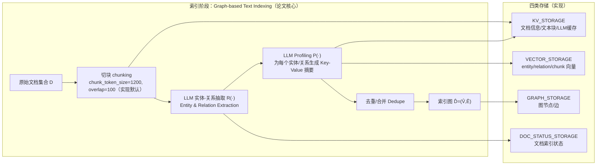
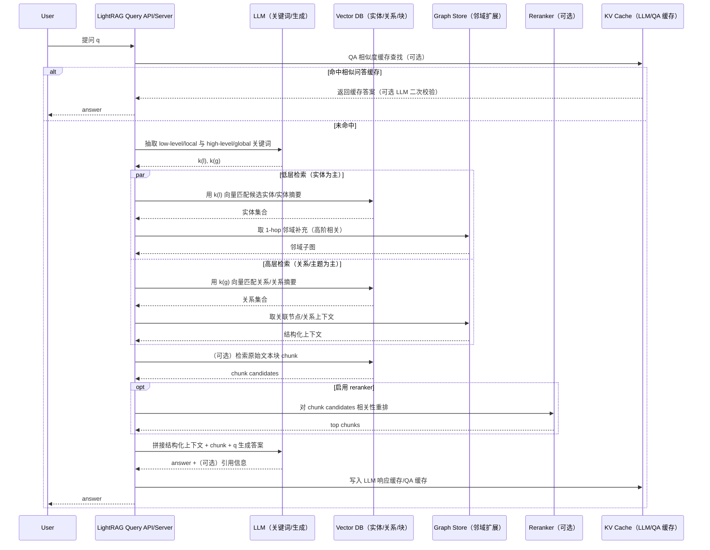

# LightRAG 技术细节与优劣势深度研究报告

## 执行摘要

LightRAG 是一种“图结构增强 + 向量检索”的检索增强生成（RAG）框架，其核心思想是在**索引阶段**用大模型从文档中抽取实体与关系构建“索引图”，并为实体/关系生成可检索的**Key-Value（键-值）摘要**；在**查询阶段**再用大模型从用户问题中抽取两类关键词（local/low-level 与 global/high-level），分别驱动对实体与关系的检索，并在图上补充邻域信息形成结构化上下文，再交给大模型生成答案。该设计旨在同时覆盖“细节型问题”和“全局/抽象问题”，并显著降低 GraphRAG 一类方法在检索期需要遍历大量社区摘要导致的高开销。citeturn30view0turn30view3turn30view4turn6view2

从官方同行评测（Findings of EMNLP 2025）给出的实证结果看：LightRAG 在 UltraDomain 的四个子域（Agriculture/CS/Legal/Mix）上，相对 NaiveRAG、RQ-RAG、HyDE 等方法，在“Comprehensiveness/Diversity/Empowerment/Overall”四个维度的**LLM 评审胜率**普遍更高；相对 GraphRAG，在部分数据集上胜率优势较小，但在**时间与空间效率**上显著更优（平均查询 11.2s vs 23.6s；最终存储 39.5MB vs 286.7MB）。citeturn4view2turn5view0turn3view1

工程实现层面，HKUDS 的开源实现把 LightRAG 做成可部署的 Server + Core：支持四类存储（KV / Vector / Graph / DocStatus）与多种后端（如 Redis/Postgres/Mongo/OpenSearch，图存储可选 Neo4j 等），并提供 LLM 结果缓存、问题-答案相似度缓存、reranker 注入、RAGAS 评估脚本与 API/WebUI 部署方式。citeturn10view0turn9view5turn10view3turn11view0turn6view0

需要强调的风险与局限：LightRAG 的“图抽取+画像”高度依赖 LLM 的信息抽取能力，索引成本与质量波动更敏感；评测指标以“LLM 判分/胜率”为主，和传统 EM/ROUGE/BLEU 并非一一对应；同时，任何 RAG（尤其带增量知识库）都面临**提示注入、知识库投毒**与隐私泄露风险，已有研究（如 USENIX Security 2025 的 PoisonedRAG）表明攻击者可通过污染知识库文本来诱导检索与生成阶段输出攻击者指定答案。citeturn7view5turn5view0turn32view0turn29search34

## 资料来源优先级与研究方法

本报告遵循“原始/官方优先”的证据层级，并在每个关键结论处给出引用：

| 优先级 | 来源类型 | 本报告所用代表性材料 |
|---|---|---|
| 最高 | 同行评审论文（原始论文） | “LightRAG: Simple and Fast Retrieval-Augmented Generation”（Findings of EMNLP 2025）citeturn23search15 |
| 最高 | 官方文档/官网 | LightRAG 官方站点技术描述（函数 R(·)/P(·) 等）citeturn6view2 |
| 最高 | 开源代码与实现文档 | HKUDS/LightRAG GitHub：Core 编程文档、API Server 文档、评估脚本等citeturn10view0turn8view3turn11view0 |
| 较高 | 作者/实现者生态资料（功能变更、评测集成） | GitHub README 的 News/变更记录（如集成 OpenSearch、RAGAS、Langfuse、reranker 等）citeturn7view0 |
| 辅助 | 第三方技术解读/教程 | LearnOpenCV 对 LightRAG 的流程图与工程实践说明（用于辅助理解，不作为唯一证据）citeturn25view0turn25view3 |
| 对比参照 | 经典 RAG 变体原始论文 | RAG（NeurIPS 2020）、DPR（EMNLP 2020）、FiD（EACL 2021）、GraphRAG（arXiv 2024）citeturn20view1turn22view0turn16view1turn13search3 |
| 评估方法参照 | RAG 自动评估论文 | RAGAS（EACL 2024 demo）citeturn31view0 |

方法上，本报告将“论文方法”与“开源工程实现”分开陈述：凡论文未定义或未报告的细节，一律标为“未指定”；工程实现新增能力（如多存储后端、缓存策略等）则以 GitHub 文档为准。citeturn8view0turn10view0turn30view4

## 背景与设计目标

基础 RAG（本文称 NaiveRAG）通常把文档切块后做向量化检索，再把 Top‑k chunk 拼到提示词里生成。其典型困难在于：当证据分散在多个 chunk、需要跨段/跨文档关联或回答“全局主题/抽象总结”时，单纯 chunk 检索容易产生碎片化上下文，导致答案缺乏整体性。citeturn6view2turn25view0

LightRAG 在论文中明确提出面向高效有效 RAG 的三个目标：  
其一，索引函数需要能抽取“全局信息”以支持大模型回答；其二，索引数据结构应支持快速、低成本检索；其三，面对外部知识库变化，需要能快速适配并更新索引结构。citeturn30view0

为达成上述目标，LightRAG 选择“**图结构**”作为索引骨架：用 LLM 从文本中抽取实体与关系构成知识图谱，再通过 LLM 为实体/关系生成 key-value 形式的可检索摘要。同时在检索阶段使用“**双层检索**”：把查询拆成更细粒度（local/low-level）与更抽象（global/high-level）的两套关键词，分别聚焦实体细节与关系/主题层面的覆盖，从而兼顾“精确细节”与“全局概念”。citeturn30view0turn30view2turn30view3turn6view2

与 GraphRAG 的定位差异也较关键：GraphRAG 为了解决“全局问题”会生成社区（community）摘要并在检索/生成时遍历、汇总多个社区，但这会带来较高的 token 与 API 调用开销；LightRAG 的“关键词+向量库匹配实体/关系”试图把检索期的开销压到更低，并通过增量更新减少重建索引图的成本。citeturn13search3turn4view3turn30view1

## 架构与数据流

下面给出两张 **Mermaid** 图：第一张是“索引（Indexing）”管线；第二张是“查询（Retrieval→Generation）”管线。图中标注了哪些来自论文方法、哪些来自开源实现的工程组件。



索引阶段的关键动作在论文中概括为：对文档切块后，用 LLM 抽取实体与关系，再经“Profiling”生成实体/关系的 key-value 数据结构，最后做去重合并形成索引图。citeturn30view0turn4view0turn6view2  
实现侧进一步把数据落到四类存储中：KV（文本块、文档信息与 LLM 响应缓存）、向量库（实体/关系/文本块的 embedding）、图存储（实体关系图）、文档状态存储（索引进度）。citeturn10view0turn9view5



论文层面的查询关键步骤是：（i）抽取 local/global 两类关键词；（ii）用向量库分别匹配实体与关系；（iii）在局部子图中补充一跳邻域以引入“高阶相关性”；最后把实体/关系/原文片段拼成上下文交给 LLM 生成。citeturn30view3turn30view4turn5view1  
实现层补充了：查询模式（local/global/hybrid/mix 等）、chunk rerank、LLM/QA 缓存与“只返回上下文/只返回提示词”等工程开关。citeturn9view1turn9view5turn9view4

image_group{"layout":"carousel","aspect_ratio":"16:9","query":["LightRAG indexing flowchart VectorDB Json KV Store","LightRAG querying flowchart dual-level retrieval generation knowledge graph","LightRAG WebUI knowledge graph visualization"],"num_per_query":1}

## 关键组件实现细节

### 检索器类型与索引结构

**论文方法的索引结构**可以概括为“索引图 + 向量化表示 + Key-Value 摘要”。索引图来自实体与关系抽取；而 LLM Profiling 会为每个实体节点与关系边生成“索引 key（短词/短语）+ value（摘要段落）”，用于快速检索与生成时提供浓缩上下文。citeturn6view2turn30view0turn30view3

**开源实现的索引持久化**被拆为四类存储（目的不同、可独立替换）：  
KV_STORAGE（LLM 响应缓存、文本块与文档信息）、VECTOR_STORAGE（实体/关系/文本块 embedding）、GRAPH_STORAGE（实体-关系图结构）、DOC_STATUS_STORAGE（文档索引状态）。citeturn10view0turn9view5

实现还给出每类存储的可选后端。例如：KV 可用 Json/Postgres/Redis/Mongo/OpenSearch；图存储可用 NetworkX/Neo4j/Postgres(AGE)/Memgraph/OpenSearch，并在文档中指出测试上 “Neo4j 在生产环境表现优于 PostgreSQL+AGE”。citeturn10view0  
向量存储可用 NanoVector（默认）、Postgres、Milvus、Faiss、Qdrant、Mongo、OpenSearch 等。citeturn10view0turn8view0

### 检索-生成接口与查询模式

LightRAG Core 提供一个较直观的检索-生成接口：`insert/ainsert` 完成索引，`query/aquery` 完成查询；并通过 `QueryParam` 控制检索行为。官方 Core 文档明确给出 `mode` 的枚举：`local/global/hybrid/naive/mix/bypass`，其中 `mix` 被解释为“融合知识图谱与向量检索”。citeturn9view0turn9view1

接口层还有几个对工程非常关键的开关：  
`only_need_context`（只取回上下文不生成）、`only_need_prompt`（只返回拼好的提示词）、`stream`（流式输出）、以及 `top_k`（在 local 模式表示实体数量、在 global 模式表示关系数量）与 `chunk_top_k`（文本块保留数量，含 rerank 后保留）。citeturn9view1turn9view4  
另外，文档强调 `user_prompt` **不参与检索阶段**，仅影响 LLM 在拿到上下文后的加工方式——这对避免“把格式化要求混入检索意图”很重要。citeturn10view0

下面是一段来自官方文档的“最小可运行”示例（略作排版调整），展示初始化、明确调用 `initialize_storages()`、插入与查询。citeturn8view0

```python
import os, asyncio
from lightrag import LightRAG, QueryParam
from lightrag.llm.openai import gpt_4o_mini_complete, openai_embed

WORKING_DIR = "./rag_storage"

async def main():
    rag = LightRAG(
        working_dir=WORKING_DIR,
        embedding_func=openai_embed,
        llm_model_func=gpt_4o_mini_complete,
    )
    await rag.initialize_storages()

    await rag.ainsert("Your text")
    out = await rag.aquery(
        "What are the top themes in this story?",
        param=QueryParam(mode="hybrid")
    )
    print(out)

    await rag.finalize_storages()

asyncio.run(main())
```

### 检索结果融合策略

**论文层面的融合策略**主要发生在“结构化上下文构建”阶段：系统会分别检索实体、关系与原文片段，并把来自 profiling 的实体/关系描述、名称以及原文摘录拼接为统一上下文输入 LLM。citeturn30view4turn5view1  
“融合”的关键不在于对 chunk 做复杂加权，而在于：通过“低层（实体细节）+高层（关系/主题覆盖）”同时取证，再引入一跳邻域补齐链路信息，以同时提升深度与广度。citeturn30view2turn30view3

**实现层面的融合策略**更具体：  
一是通过 `mode` 选择 local/global/hybrid/mix；二是在文本块层面支持 reranker（`enable_rerank`），并给出 reranker 注入方式（如 Cohere/vLLM、Jina、阿里云等 provider）。citeturn9view4turn10view0  
三是通过 token 预算（如 `max_entity_tokens`、`max_relation_tokens`）控制“实体上下文/关系上下文/块上下文”在最终 prompt 中的占比，以适配上下文窗口限制。citeturn9view1turn8view0

### 训练与微调方法、损失函数

**LightRAG 本身（论文方法）不以“训练一个新模型”为中心**：其贡献主要在索引结构、检索策略与提示构造；论文中的关键学习过程由外部 LLM 完成（抽取、关键词生成、最终生成），检索依赖向量库匹配而非端到端可微训练（未指定任何 LightRAG 特有损失函数）。citeturn30view3turn30view4turn6view2  
开源实现同样把 LLM/Embedding/Reranker 作为“可注入的外部组件”，并未要求训练 LightRAG 自身参数。citeturn8view0turn9view4

但在工程上，**你完全可以（也常常需要）训练/微调“检索侧模型”**来提升 LightRAG 的效果。下面给出可复现、与主流 RAG 体系兼容的两类方案（属于建议，不是 LightRAG 论文规定）：

* 方案一：微调 Dense Retriever（DPR 类）  
  DPR 的标准目标是“正样本 passage 的 softmax NLL”，即让问题向量与正 passage 的相似度高于负 passage。其损失在原论文中明确给出：  
  \[
  \mathcal{L} = -\log \frac{e^{sim(q,p^+)}}{e^{sim(q,p^+)} + \sum_j e^{sim(q,p_j^-)}}
  \]
  这类训练可用于：让“实体/关系 key-value 描述”在 embedding 空间中更贴近真实查询分布。citeturn22view0turn21view2

* 方案二：端到端 RAG（RAG-Sequence/RAG-Token）式联合训练  
  经典 RAG 论文将检索文档视为潜变量，对生成概率做边缘化；训练目标是最小化目标序列的负边缘 log-likelihood。该点在原文中明确表述为“minimize negative marginal log-likelihood”。citeturn19view1turn20view1  
  这更适合“固定文档库 + 端到端 QA”场景，而 LightRAG 的核心卖点之一是“增量更新+图索引”，两者可结合但会增加系统复杂度（此结合在 LightRAG 官方材料中未指定）。

### 推理流程与缓存机制

LightRAG Core 提供两层缓存思路：

1) **LLM 结果缓存**：`enable_llm_cache` 可把 LLM 调用结果写入缓存，重复 prompt 可直接返回；并可单独对实体抽取开启缓存（`enable_llm_cache_for_entity_extract`），用于调试与降低重复索引成本。citeturn9view5turn8view0  

2) **问答相似度缓存（embedding_cache_config）**：可配置 `similarity_threshold`，当新问题与历史问题 embedding 相似度超过阈值时直接返回缓存答案；还可启用 `use_llm_check` 做二次校验。citeturn9view5turn9view0  

在并发与吞吐方面，Core 文档列出 embedding 异步并发上限（`embedding_func_max_async`）、LLM 并发上限（`llm_model_max_async`）等参数；Server 侧则支持 Uvicorn 单进程模式与 Gunicorn+Uvicorn 多进程模式（workers 可配置）。这些为“吞吐/延迟工程优化”提供了明确抓手，但官方论文并未给出端到端 QPS 指标（未指定）。citeturn8view0turn10view3

### 增量更新与复杂度提示

论文明确主张“增量更新”通过把新增图数据与原图做节点集/边集的并集来整合，从而避免重建整个索引图，并以“无须重建、降低计算开销”为目标。citeturn30view1turn6view2  
复杂度分析中，论文指出索引期需要调用 LLM 约为 `total_tokens / chunk_size` 次，并强调“没有额外的索引重建开销”。citeturn30view4turn3view1  
实现侧还提供批量插入与“pipeline 异步入队处理”的接口（可在主线程继续工作时后台增量插入）。citeturn10view1

## 性能评估与对比

### LightRAG 论文评测设置与指标解释

论文在 UltraDomain benchmark 的四个数据集上评测，并比较 NaiveRAG、RQ-RAG、HyDE、GraphRAG 等基线。数据集规模在 60 万到 500 万 tokens 之间，论文附录还给出每个子域的文档数与 token 数。citeturn4view4turn30view4  
由于“复杂高层语义问题”难以定义标准答案，论文采用 LLM 判分的多维比较：Comprehensiveness、Diversity、Empowerment、Overall，并通过交替答案顺序来缓解位置偏置，最后报告“胜率（win rate）”。citeturn5view0turn12view5

### 生成质量与胜率结果

下表整理自论文 Table 1（胜率%，baseline vs LightRAG）。为节省篇幅，这里保留“Overall”维度（完整四维见论文原表）。citeturn4view2

| 数据集 | NaiveRAG Overall | LightRAG Overall | RQ-RAG Overall | LightRAG Overall | HyDE Overall | LightRAG Overall | GraphRAG Overall | LightRAG Overall |
|---|---:|---:|---:|---:|---:|---:|---:|---:|
| Agriculture | 32.4 | 67.6 | 32.4 | 67.6 | 24.8 | 75.2 | 45.2 | 54.8 |
| CS | 38.8 | 61.2 | 38.0 | 62.0 | 41.6 | 58.4 | 48.0 | 52.0 |
| Legal | 15.2 | 84.8 | 14.4 | 85.6 | 26.4 | 73.6 | 47.2 | 52.8 |
| Mix | 40.0 | 60.0 | 40.0 | 60.0 | 42.4 | 57.6 | 50.4 | 49.6 |

**解读要点**：  
在 Legal 这类超大、跨条款关联强的数据上，LightRAG 相对 NaiveRAG/RQ-RAG 的优势尤其明显（Overall 约 85% 胜率）。相对 GraphRAG，LightRAG 在部分数据集上仅小幅领先甚至接近（如 Mix 的 Overall 在表中略低于 GraphRAG），但后续的成本与时延对比显示 LightRAG 更“轻量”。citeturn4view2turn5view0

### 消融实验：双层检索与“是否使用原文”

论文 Table 2 通过 -High（移除高层检索）、-Low（移除低层检索）、-Origin（不使用原始文本，仅用图摘要）等变体说明：  
移除任一层检索都会导致多数据集多维度性能下降；而 -Origin 在部分场景下降不明显甚至有提升，论文将其解释为：图索引过程已抽取关键信息，原文可能引入噪声。citeturn4view3turn12view5

### 延迟、存储与检索成本

论文在附录给出时间与空间对比：文档插入耗时（Table 5）、平均查询时间（Table 6）与最终存储占用（Table 7）。citeturn5view0

| 指标 | LightRAG | GraphRAG |
|---|---:|---:|
| 平均查询时间（s） | 11.2 | 23.6 |
| 最终存储占用（MB） | 39.5 | 286.7 |

文档插入实验中，LightRAG 插入 5 份文档（约 4 万–7 万 tokens/文档）耗时 418–561s，GraphRAG 为 642–953s。citeturn5view0  
此外，论文 Table 3 从 token 与 API calls 角度指出：GraphRAG 在 retrieval phase 需要处理大量 community report（示例为 610×1000 tokens 且需多次 API 调用），而 LightRAG 用于“关键词生成与检索”的 token 少于 100 且可用单次 API call 完成。citeturn4view3turn12view5

### 工程评估：RAGAS 与可复现实验脚本

开源实现提供基于 RAGAS 的评估框架，指标覆盖 Faithfulness、Answer Relevance、Context Recall、Context Precision，并给出“>0.80 作为较好分数”的经验阈值与脚本入口（`eval_rag_quality.py`）。citeturn11view0turn31view0  
需要注意：仓库示例声称在 sample questions 上可得到约 0.89–1.00 的 RAGAS 分数，但这属于小样例验证；严谨评测仍应在更大规模、跨域数据集与多种问题类型上复现（示例之外的性能：未指定）。citeturn11view0

### 与常见 RAG 变体的对比

下表从“架构/训练/资源/可扩展/可解释/安全性”等维度对比 LightRAG 与经典、常见 RAG 变体。由于各论文评测任务不同，表中“性能”只引用各自论文内的典型指标（不可直接横向等价比较），不可比处标注“任务不同/未指定”。citeturn4view2turn20view1turn16view1turn22view0turn13search3turn32view0

| 方法 | 核心索引/检索对象 | 生成器侧融合方式 | 是否端到端训练 | 典型损失/目标 | 典型性能报告（论文内） | 资源/可扩展性 | 可解释性 | 安全性要点 |
|---|---|---|---|---|---|---|---|---|
| LightRAG | 实体/关系图 + KV 摘要 + 向量库（实体/关系/块）citeturn30view3turn10view0 | 结构化上下文（实体/关系/块）拼接后生成citeturn30view4turn5view1 | 不以训练为中心（未指定 LightRAG 特有损失）citeturn30view4turn8view0 | 未指定（可选用 DPR/RAG 等训练检索组件） | UltraDomain 上 LLM 评审胜率显著优于 NaiveRAG/RQ-RAG/HyDE；查询 11.2s、存储 39.5MB（对比 GraphRAG）citeturn4view2turn5view0 | 检索期轻量；索引期依赖 LLM 抽取（成本较高且受模型影响）citeturn7view5turn30view4 | 图+引用可提供一定可解释性；实现支持 citationciteturn10view1turn7view0 | 受知识库投毒/提示注入影响；需防护citeturn32view0turn29search34 |
| RAG-Sequence | 检索文档 z 作为“整段输出共享的潜变量”citeturn20view1 | 针对每个 z 生成序列并边缘化 | 是 | 负边缘 log-likelihood（联合训练检索与生成）citeturn19view1turn20view1 | NQ/TriviaQA/等任务 EM、ROUGE 等（具体见原表；与 UltraDomain 不同）citeturn20view2 | 需要可微检索与训练；推理需对多文档做 beam/近似边缘化，开销较大citeturn18view3turn20view1 | 可追溯到检索文档 | 同样受检索污染影响citeturn32view0 |
| RAG-Token | 每个 token 可选不同潜文档 z_iciteturn20view1 | token 级混合（对每步 token 做边缘化） | 是 | 同上 | 在部分生成任务更优（如 Jeopardy QGen 等）citeturn20view2 | token 级边缘化与解码更复杂，通常更慢 | 可追溯但更复杂 | 同上citeturn32view0 |
| DPR | 问题/段落 dual-encoder dense 检索，检索对象是 passageciteturn17view1turn22view0 | 不负责生成（通常配 reader） | 是（训练检索器） | softmax NLL（含 in-batch negatives）citeturn22view0turn22view1 | 报告 top‑k retrieval accuracy 等；可高效 FAISS 检索citeturn21view5turn22view2 | 高可扩展（ANN/FAISS），是多种 RAG 的底座citeturn21view5 | 检索结果可展示 | 检索器可被后门/投毒影响citeturn32view0turn29search14 |
| FiD（Fusion-in-Decoder） | 检索 passage（BM25 或 DPR），输入是多 passageciteturn16view1turn15view0 | encoder 独立编码每个 passage，decoder 在拼接表示上做融合citeturn16view0turn15view0 | 是（reader/generator 训练） | seq2seq 目标（论文为 QA 生成） | 在 NQ/TriviaQA 等上 EM 显著高（例：FiD-large NQ EM 51.4）citeturn16view1 | 可扩展到更多 passage（计算近似线性增长），但仍较耗算力citeturn16view1 | 可解释到 passage 级 | 同样受检索污染影响citeturn32view0 |
| DPR + FiD | DPR 检索 + FiD 生成（常见组合）citeturn16view1turn22view0 | 同 FiD | 部分（检索/生成可分别训练） | DPR NLL + FiD seq2seq | FiD 论文表中包含 DPR、RAG 等对比citeturn16view1 | 组合可扩展，但端到端成本仍高 | passage 可解释 | 同上citeturn32view0 |
| GraphRAG | 实体图 + community 检索与摘要（偏全局 QFS）citeturn13search3turn4view3 | 多社区 partial response 再汇总 | 多为流程式（不强调端到端训练） | 未指定统一损失 | 适合“全局主题”问题；但检索期 token/API 调用开销大（论文对比）citeturn4view3turn5view0 | 索引与检索更重，更新成本更高 | 社区摘要有解释性 | 同样受投毒/注入影响citeturn32view0 |

## 工程注意点、可复现实验设计、部署与成本估算、未来方向

### 优势、局限与工程注意点

**优势（相对 NaiveRAG / 仅 chunk 检索）**在于：  
图索引让系统能把分散证据组织为实体-关系网络，双层检索让它同时覆盖“实体细节”和“主题/关系层面”的证据聚合；论文评测显示在大型、复杂语义数据（尤其 Legal）上胜率优势明显。citeturn30view3turn4view2turn25view2  
相对 GraphRAG，LightRAG 的关键卖点是“检索期轻量”：查询耗时更低、存储占用更小，并通过关键词驱动的实体/关系检索避免了遍历大量社区摘要。citeturn5view0turn4view3turn30view4

**局限与注意点**主要集中在四类问题：

1) **索引质量与成本敏感**：LightRAG 需要 LLM 在索引期做实体-关系抽取，这比传统 RAG 对 LLM 能力要求更高；官方 README 直言这类任务“对 LLM 能力要求显著高于传统 RAG”，且 Core 文档在模型选择建议中要求较大参数量与更长上下文（用于索引/查询）。citeturn7view5turn9view1turn9view4

2) **检索噪声与数据偏差**：LLM 抽取的实体/关系可能“漏抽、错连、过度概括”，从而把偏差固化在图索引中（论文未给出抽取准确率的独立指标；未指定）。citeturn30view0turn30view4  
工程上建议在高风险领域（法务/医疗/金融）增加“可追溯引用、人工抽检、对齐 domain entity types”与更强的 reranker，以抵消噪声（reranker 支持与建议见官方文档）。citeturn7view4turn9view4turn10view1

3) **上下文窗口限制与 token 预算**：即便 LightRAG 能检索到大量实体/关系/文本块，最终仍需在 LLM 上下文窗口内完成组织。实现提供 `max_entity_tokens/max_relation_tokens/chunk_top_k` 等参数做统一 token 控制；若不控制，容易出现“拼接超长上下文导致生成质量下降或成本飙升”。citeturn9view1turn31view0

4) **Embedding 维度与存储迁移陷阱**：官方 README 明确强调“embedding 模型必须在索引前确定，查询时必须一致”；对于某些存储（如 PostgreSQL 向量表），维度需建表时确定，因此更换 embedding 需要清理并重建向量相关表。citeturn6view0turn27view0turn9view5

### 安全性与隐私风险

RAG 的根本风险之一是把“外部知识库文本”当作模型上下文的一部分，因此会暴露在**提示注入（prompt injection）**与**知识库投毒（poisoning）**下。OWASP GenAI Top 10 将 Prompt Injection 作为 LLM01 风险条目，并指出攻击者可通过输入操纵模型行为。citeturn29search34turn29search17  

更贴近 RAG 的实证攻击中，USENIX Security 2025 的 PoisonedRAG 将 RAG 形式化为“知识库 + 检索器 + LLM”，并展示攻击者可“构造能被检索到的恶意文本”来诱导 LLM 对目标问题输出攻击者指定答案；论文还讨论了传统 prompt injection 直接扩展到 RAG 的局限，以及 PoisonedRAG 通过同时满足“可检索性 + 误导生成性”来提升攻击效果。citeturn32view0  

对 LightRAG 的特别含义在于：它不仅检索原文 chunk，还检索“实体/关系摘要（Profiling 产物）”，这会引入额外攻击面：一旦摘要生成阶段受到污染或被注入指令，可能影响更大范围的查询（针对性风险评测在官方材料中未指定）。citeturn6view2turn32view0  

工程防护建议（原则性，具体方案需结合你的威胁模型）：
- 数据入口：严格来源控制与审计（尤其是可被外部用户写入的知识库）。citeturn32view0  
- 检索入口：对返回上下文做安全过滤与“指令剥离”（把检索到的文本明确标为引用材料，而非系统指令）。citeturn29search34turn32view0  
- 生成入口：采用“最小授权提示词”、输出约束与敏感字段脱敏；必要时引入独立的安全策略层（相关研究方向近年快速增长）。citeturn29search2turn32view0  
- 运维侧：使用仓库提供的 `.env` 安全审计命令（`make env-security-check`）并隔离多实例工作区，减少配置泄露与数据串扰。citeturn7view0turn10view3turn10view1  

### 可复现实验设计与超参建议

**复现实验目标**：在与你业务更接近的数据集上，验证 LightRAG 是否真的提升“检索质量 + 生成质量”，并量化其成本（token/时延/存储）。

**数据与任务设计**（可复现框架）：
- 参考论文使用 UltraDomain 子域的数据规模设定（百万 token 级），并在每个子域构造“细节型问答 + 抽象型总结 + 多跳推理”混合问题集。论文附录描述其问题生成流程：基于用户角色/任务组合生成问题，总量为每个数据集 125 个问题。citeturn4view4turn5view0  
- 评测维度建议同时保留两套：  
  (a) 论文式“LLM pairwise judge（Comprehensiveness/Diversity/Empowerment/Overall）”以覆盖开放式答案质量；并严格执行“交换答案顺序”以降低偏置。citeturn5view0turn4view2  
  (b) RAGAS（Faithfulness/Answer Relevance/Context Recall/Context Precision）以获得更贴近“检索是否干净、生成是否基于证据”的指标。citeturn31view0turn11view0  

**基线选择**（建议最少包含）：
- NaiveRAG（只做 chunk 向量检索 + 拼接生成）——论文基线。citeturn4view4turn6view2  
- HyDE、RQ-RAG（查询生成/改写类增强）——论文基线且代表“非图增强”的主流路线。citeturn4view2turn23search0turn23search1  
- GraphRAG（若你的任务包含大量“全局主题”问题）。citeturn13search3turn4view3  

**关键超参建议**（以“官方默认/论文设定”为起点）：
- chunk：`chunk_token_size=1200`、`chunk_overlap_token_size=100`（实现默认；论文实验亦使用 1200）。citeturn8view0turn5view0  
- entity 抽取循环：`entity_extract_max_gleaning=1`（论文称 gleaning 参数固定为 1）。citeturn8view0turn5view0  
- 检索数量：`top_k` 默认 60、`chunk_top_k` 默认 20（实现给出环境变量可覆盖）。建议在你的数据上做网格：`top_k∈{20,40,60,80}`、`chunk_top_k∈{5,10,20,40}`。citeturn9view1  
- 余弦阈值：实现把向量检索阈值暴露在 `COSINE_THRESHOLD`（默认文档示例 0.2）；建议在噪声高的数据上抬高阈值并配 reranker。citeturn9view5turn8view0  
- reranker：实现建议启用 reranker 并把查询模式设为 `mix`；并推荐 `BAAI/bge-reranker-v2-m3` 等模型（用于提升 mixed queries 的检索表现）。citeturn7view4turn9view4  

**评估输出建议**：除最终答案外，务必保存“检索上下文”与“引用来源”，以便计算 context precision/recall 并做错误分析；仓库变更记录提到 API 已支持返回 retrieved contexts 以支撑此类指标。citeturn7view0turn11view0

### 实际部署建议与成本估算

#### 部署形态建议

官方建议：如果要集成到业务系统，优先使用 **LightRAG Server 的 REST API**；Core 更偏“嵌入式/研究评估”。citeturn8view0turn6view0  
Server 支持两种运行模式：Uvicorn（简单高效）与 Gunicorn+Uvicorn（多进程生产模式，非 Windows）。Server 启动时要求当前目录包含 `.env`，以便并行运行多实例并通过不同 `.env` 隔离配置。citeturn10view3turn7view0

存储选型建议（按规模递进）：
- 小规模/研发：默认 JsonKV + NetworkX + NanoVector（零外部依赖、易复现）。citeturn10view0turn8view0  
- 中规模/生产：图存储优先 Neo4j（官方文档称测试中 Neo4j 优于 Postgres+AGE），KV/向量可用 Postgres 或专用向量库；并按需启用 workspace 做多知识库隔离。citeturn10view0turn10view1  
- 统一后端：仓库 News 提到已集成 OpenSearch 作为“统一存储后端”以覆盖四类存储（属于实现扩展能力）。citeturn7view3turn7view0  

#### 成本估算框架

**一、按“API token 计费”的云方案（示例采用 GPT‑4o mini 与 OpenAI embedding 的官方价格）**  
OpenAI 官方文档给出 GPT‑4o mini 的计费：输入 $0.15/1M tokens、输出 $0.60/1M tokens；`text-embedding-3-large` 为 $0.13/1M tokens（`text-embedding-3-small` 为 $0.02/1M）。citeturn26search6turn26search5turn26search15  

- **检索期（retrieval phase）对比示例**：论文 Table 3 指出 GraphRAG 在某实验中需要处理约 610k tokens 的社区报告，而 LightRAG 关键词生成与检索 <100 tokens 且 1 次调用。若用 GPT‑4o mini 估算，仅输入侧 token 成本大致是：  
  GraphRAG：0.610M × $0.15 ≈ **$0.0915**（仅示例；未含输出、未含多次调用及其他阶段）  
  LightRAG：0.0001M × $0.15 ≈ **$0.000015**  
  该对比主要体现“token 级与调用次数级”差异方向；端到端成本还取决于生成长度、rerank、索引期抽取规模等（论文 Table 3 未完全覆盖）。citeturn4view3turn26search6

- **索引期成本（最关键但最不确定）**：论文给出索引期 LLM 调用次数约为 `total_tokens / chunk_size`，并在附录给出 Legal 数据约 5,081,069 tokens、chunk_size=1200（实现默认）意味着约 4234 个 chunk 量级的抽取调用。实际每次调用的“prompt tokens/输出 tokens”在论文中未逐项报告（未指定），因此成本建议用公式化估算：  
  \[
  Cost_{index} \approx \sum_{chunks}\big((T_{prompt}+T_{chunk})\cdot P_{in} + T_{out}\cdot P_{out}\big) + Cost_{embed}
  \]
  其中 `T_out` 可参考实现里 `summary_max_tokens` 的默认 500（但它是否等同于索引抽取输出上限：未指定），`Cost_embed` 取决于你是否对 chunk/实体/关系都做 embedding（实现确实支持 entity/relation/chunk embedding）。citeturn30view4turn8view0turn10view0turn4view4

**二、按“GPU 时长计费”的本地/自托管方案（云 GPU 示例）**  
若你希望在本地或私有云用开源模型完成索引/生成，核心成本来自 GPU。参考公开定价：Lambda GPU 云给出 A100 80GB 约 $2.79/GPU/hr（另有 H100 等），RunPod 也提供按小时的 A100 80GB 价格档（页面给出 $/hr 条目）。citeturn27search2turn27search25  
而在 AWS 侧，官方 Capacity Blocks for ML 页面给出 p4d.24xlarge（8×A100）的“有效每加速器小时价”示例（如 $1.475/accelerator/hr，注意这是 Capacity Blocks 定价形态，并非普通 on-demand；适用于预留算力块）。citeturn27search23  

因此，建议按你的吞吐需求拆分成本：
- 索引期：LLM 抽取是瓶颈（实现也提示瓶颈通常在 LLM），应优先预估“每百万 tokens 文档索引需要的 GPU 小时”。citeturn10view1turn30view4turn7view5  
- 查询期：若启用缓存与 reranker，可显著降低重复问题成本；Server 可通过多 worker 扩展并发。citeturn9view5turn10view3turn9view4  

### 结论与未来研究方向

综合论文与开源实现证据，LightRAG 可被视为一种面向“长文档、多主题、多跳关联”场景的图增强 RAG：其双层检索与“检索实体/关系而非仅检索 chunk”的设计，在 UltraDomain 上展示了明显的生成质量优势，同时在对比 GraphRAG 时体现出较强的时间/空间效率。citeturn30view3turn4view2turn5view0turn4view3  

未来改进方向可归纳为四条主线（其中多条在官方材料未给出完整方案，属研究展望）：  
其一，提高索引图抽取的可靠性与可控性（减少 LLM 抽取错误的系统性影响）；其二，把评测从“LLM 胜率”拓展到更可解释的检索指标与更强的 reference-free 指标体系（如 RAGAS 及其变体），并在更广泛基准上复现；其三，面向真实部署强化安全与隐私防护，尤其是知识库投毒与提示注入（PoisonedRAG 等工作已证明其可行性与危害）；其四，进一步降低索引期成本并增强增量更新的一致性（例如更细粒度的变更检测、缓存复用与后端统一）。citeturn31view0turn11view0turn32view0turn30view1turn7view0
