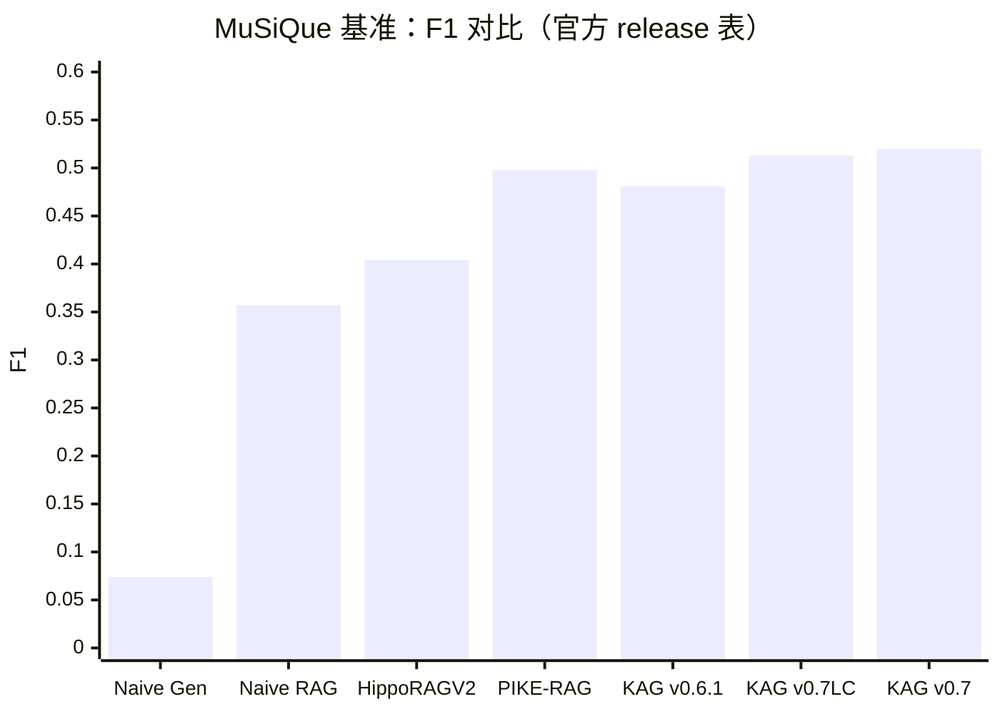

# OpenSPG 与 KAG 的深度研究报告

## 执行摘要

本报告聚焦两个紧密耦合的开源项目：OpenSPG（知识图谱引擎）与 KAG（面向专业领域知识库的“逻辑形式引导的推理与检索”框架）。两者的关系可以概括为：OpenSPG 提供“可编程的语义知识图谱引擎能力”（建模、存储、检索、推理算子与可插拔基础设施适配），KAG 在其上构建“面向问答/推理的知识增强生成体系”（知识构建 kg-builder + 求解与推理 kg-solver，并规划未来逐步开源 kag-model）。citeturn16search0turn16search3turn5view1

从“只懂基础 RAG”的视角看，KAG 的核心差异不在“把向量检索结果塞给 LLM”，而在于：它试图把知识库从“碎片文本 + 相似度”升级为“结构化/半结构化/非结构化统一到 DIKW 分层的业务知识图谱 + 互索引 + 逻辑符号引导的混合检索与推理”。其官方阐述强调：相较传统 RAG 的向量相似度歧义、以及基于 OpenIE 的 GraphRAG 噪声问题，KAG 用“概念语义推理对齐（降噪）+ Schema 约束构建（提质）+ 逻辑形式引导混合求解（多跳与可解释）”来提升专业领域推理问答能力。citeturn5view1turn9search5turn0search33

在工程落地层面，OpenSPG 的默认发行版以 Docker Compose 方式部署，核心依赖包含 MySQL（元数据/任务等）、Neo4j（默认图存储，并可作为搜索引擎）、MinIO（对象存储），并通过 “cloudext” 插件层提供对多种基础设施的可插拔适配（图存储 Neo4j/TuGraph；搜索引擎 Neo4j/Elasticsearch；对象存储 MinIO/OSS；缓存 Redis）。citeturn6view0turn19view0turn19view1turn19view2turn19view3

在检索侧，KAG 近期版本强调“可配置索引管理（IndexManager）”，内置多类基础索引（Outline、Summary、KnowledgeUnit、AtomicQuery、Chunk、Table），并在应用侧可按索引类型自动适配检索器；代码层可见其向量化组件支持稠密向量与稀疏向量两类索引字段，且索引字段的生成与 Schema 的 index_type（Vector/TextAndVector/SparseVector/TextAndSparseVector 等）绑定。citeturn8view0turn23view0

在性能证据方面，KAG 官方 release 给出了多跳问答基准（例如 MuSiQue 的 EM/F1/LLM_Accuracy 表格），并强调“轻量构建（Lightweight Build）”可显著降低知识构建 token 成本、且对多跳基准准确率跌幅较小；另外还提供了“open_benchmark”用于对齐不同 RAG 方法。citeturn8view0 但需要注意：这些数值依赖特定模型与配置（release 中提及 Qwen2.5-72B、bge-m3 等），且不等同于你在自有数据/硬件上的实际收益。citeturn8view0turn26search2

对比主流 RAG 框架（以 deepset 的 Haystack、LlamaIndex OSS、LangChain 为代表）：它们更擅长“快速搭建与编排检索-生成流水线/Agent 工作流”，生态连接器更丰富、学习曲线更平缓；而 OpenSPG+KAG 更像“知识工程 + 推理引擎”路线，适合强逻辑、强约束、需要图谱/规则/多跳推理可解释的专业场景，但对 Schema 设计、知识构建质量、运维与调优能力提出更高要求。citeturn24search4turn26search1turn26search2turn24search6turn5view1turn16search3

## 研究范围与假设

本报告的“版本视角”与资料来源以截至 2026-04-06（America/Los_Angeles）可公开访问的官方仓库/文档/论文为准；当官方文档存在访问限制（如部分站点受限）时，以 GitHub README、Release Notes、源码与可访问的官方/论文页面替代。citeturn5view1turn8view0turn16search0turn23view0

为避免“环境不明导致的伪精确”，涉及性能、成本、吞吐、延迟等内容时，本报告仅引用官方公开数据或明确标注为推断，并给出你可复现实验的建议配置；不对你的真实业务环境做未经验证的断言。citeturn8view0turn25search0turn25search1

显式假设如下（若与你情况不符，应在评估实验中替换）：

- **软件版本假设**：OpenSPG 采用其公开 docker-compose “release”配置；KAG 关注其公开 Release（0.8.0 及 0.7/0.7.1）的功能描述，并结合 master 分支源码片段理解组件机制。citeturn6view0turn8view0turn23view0  
- **硬件假设**：默认单机部署（Docker Compose），内存配置以官方 compose 中 JVM/Neo4j 的参数为参考（例如 server JVM -Xmx8192m；Neo4j heap/pagecache 配置等），不预设 GPU。citeturn6view0  
- **模型与调用方式假设**：KAG 的 builder/solver 通过配置接入外部 LLM 与 Embedding 服务（可为 OpenAI 兼容 API、DashScope、Ollama 等），示例采用 DeepSeek API 与 bge-m3 embedding。citeturn12view0turn21view1  
- **向量检索算法假设**：当底座使用 Elasticsearch 或 Neo4j 的向量索引时，ANN 主要采用 HNSW（Elasticsearch 还可能使用 DiskBBQ 等结构），相似度函数按底座实现（Neo4j 支持 cosine/euclidean 等）。citeturn25search0turn25search1turn25search4turn25search6  

## 项目概览与生态

OpenSPG 是一个以 SPG（Semantic-enhanced Programmable Graph）框架为基础设计实现的知识图谱开放引擎，官方定位强调：它为领域图谱构建提供语义表示、逻辑规则定义、算子框架（构建、推理）等能力，并支持各厂商可插拔适配基础引擎与算法服务以构建自定义方案。citeturn16search3 其英文 README 进一步说明该项目由 entity["company","Ant Group","fintech company"] 与 entity["organization","OpenKG","open knowledge graph org"] 合作开源，凝结了金融领域知识图谱构建与应用经验；并描述 SPG 将 LPG（属性图）结构与 RDF 语义优势进行融合，以在避免 RDF/OWL 工业落地复杂度的同时，继承属性图库的简洁与大数据生态兼容性。citeturn16search0

KAG（项目名在仓库中常写作 KAG/KAG-Builder/KAG-Solver）是基于 OpenSPG 引擎与大型语言模型的逻辑推理问答框架，用于构建垂直领域知识库的逻辑推理与多跳事实问答解决方案。其 README 明确将目标定位为“专业领域知识增强 LLM 服务框架”，并列出关键机制：知识与 Chunk 的互索引结构、概念语义推理驱动的知识对齐、Schema-Constraint 的知识构建、逻辑符号引导的混合推理与检索。citeturn5view1turn9search5 与此同时，KAG 在架构上拆分为 kg-builder、kg-solver、kag-model 三部分，当前 release 表示主要开源前两者，kag-model 将逐步开源。citeturn5view1turn8view0

开源许可与社区活跃度方面，OpenSPG 与 KAG 均采用 Apache License 2.0。citeturn5view1turn16search0 以 entity["company","GitHub","code hosting platform"] 页面可见的公开统计为例：KAG 仓库 stars 量级显著高于 OpenSPG（同一组织下的两个仓库分别呈现“更偏应用框架”和“更偏底座引擎”的关注度差异），且 KAG 发布节奏在 2024-10 至 2025-06 期间较为密集（0.5→0.6→0.7/0.7.1→0.8.0），同时 master 在 2026 年仍有更新记录。citeturn5view1turn8view0turn20search7turn16search12

与“训练/模型”相关的生态补充：官方 release 提到已适配 KAG-Thinker 模型；此外存在独立仓库 KAG-Thinker，提供训练与推理部署说明（训练使用 LLaMA-Factory；推理建议 vLLM 部署、并需要检索服务）。citeturn8view0turn11search2 同时，OpenSPG 在 entity["company","Hugging Face","ml platform company"] 上发布了 KAG-Thinker 模型与训练数据集条目，表明其在“框架 + 专用推理模型”方向上有进一步工程化布局。citeturn9search8

## 架构与数据流

从系统分层看，OpenSPG 更像“知识图谱引擎底座”：负责 Schema/语义建模、知识构建算子编排、推理与查询、以及对图存储/搜索引擎/对象存储/缓存的可插拔适配；而 KAG 在 OpenSPG 提供的知识表示与检索查询能力之上，加入了面向问答的“规划—检索—推理—生成”求解框架与可配置索引体系。citeturn16search3turn5view1turn8view0turn19view1

image_group{"layout":"carousel","aspect_ratio":"16:9","query":["OpenSPG architecture diagram","KAG technical architecture diagram OpenSPG","OpenSPG KAG product UI knowledge exploration","KAG logical form solver diagram"] ,"num_per_query":1}

下面给出一个“合并视角”的架构示意（mermaid 为概念图，用于帮助你建立心智模型；具体模块名称与能力以仓库与 release 描述为准）。citeturn16search3turn5view1turn8view0turn19view0turn19view1turn19view2turn19view3

```mermaid
flowchart TB
  subgraph DataLayer[数据源层]
    U1[非结构化: PDF/Markdown/Word/网页/日志]
    U2[结构化: 表/交易/统计/审批]
    U3[专家经验: 术语表/规则/本体]
  end

  subgraph OpenSPGEngine[OpenSPG 引擎层]
    S1[Schema/领域模型<br/>SPG 语义表示]
    S2[构建算子框架<br/>抽取/标准化/对齐/写入]
    S3[推理与查询<br/>图查询/规则/算子]
    S4[CloudExt 可插拔适配<br/>GraphStore/SearchEngine/ObjectStorage/Cache]
  end

  subgraph Storage[可插拔基础设施]
    G1[(图存储<br/>Neo4j/TuGraph)]
    SE[(搜索/索引<br/>Neo4j/Elasticsearch)]
    OS[(对象存储<br/>MinIO/OSS)]
    C[(缓存<br/>Redis)]
    RDB[(关系库<br/>MySQL)]
  end

  subgraph KAG[ KAG 框架层 ]
    B[kg-builder<br/>DIKW 分层 + 互索引]
    I[IndexManager<br/>多索引类型/Extractor/Retriever]
    P[Planner<br/>Static/Iterative 规划]
    E[Executors<br/>hybrid/math/cypher/自定义工具(MCP)]
    G[Generator<br/>答案生成/引用对齐]
  end

  DataLayer --> B --> I --> OpenSPGEngine
  OpenSPGEngine --> Storage
  P --> E --> I --> G
  I --> OpenSPGEngine
  OpenSPGEngine --> P
```

### 核心数据流

“知识库构建（离线/准离线）”流：KAG 示例工程中，开发者通过配置指定 openie_llm（用于抽取）、vectorize_model（用于 embedding），并用 builder chain（splitter→extractor→post_processor→vectorizer→writer）将文档切分、抽取实体/关系/属性、做标准化与对齐，再写入 OpenSPG 服务端/图存储与索引体系；构建过程中会产生 checkpoint 以便断点续跑与统计审计。citeturn12view0turn21view1turn16search22

“推理问答（在线）”流：KAG-Solver 将自然语言问题转为“语言+符号”的求解过程：Planner 生成逻辑形式/子问题（支持 static 与 iterative 规划模式），Executors 调用不同算子（精确匹配检索、文本/向量检索、数值计算、语义推理、Cypher 图查询等），并可通过 MCP 接入外部数据源或工具；最后 Generator 在多轮迭代与记忆/反思模块配合下生成答案，并在产品形态上支持流式输出与引用关联。citeturn5view1turn8view0turn16search22turn12view0

## 检索与索引层

### OpenSPG 的可插拔存储/索引底座

OpenSPG 通过 cloudext 分层，把图存储、搜索引擎、对象存储与缓存做成可插拔实现：图存储实现目录中可见 Neo4j 与 TuGraph；搜索引擎实现目录中可见 Neo4j 与 Elasticsearch；对象存储可选 MinIO 或 OSS；缓存实现包含 Redis。citeturn19view0turn19view1turn19view2turn19view3 这意味着在“向量检索/倒排索引/图查询”的能力边界上，你很大程度受到底座引擎能力影响：例如 Elasticsearch 的向量检索能力与其 ANN 实现一致，而 Neo4j 的向量索引、相似度函数与图查询通过 Cypher 可以形成“图+向量”的复合查询。citeturn25search0turn25search1turn25search6

默认发行版部署上，OpenSPG 的 docker-compose 显示：服务端容器依赖 mysql、neo4j、minio；并通过参数指定 JDBC host/password（repository）、以及 graphstore/searchengine URL（默认均指向 neo4j），同时暴露 8887（OpenSPG server）、7474/7687（Neo4j）、9000/9001（MinIO）等端口。citeturn6view0 这为“单机快速体验”提供了低门槛路径，但也提示你在生产化时需要更严肃地处理：Neo4j/Elasticsearch 的容量、分片、索引构建时间与一致性策略，以及对象存储与权限隔离等问题。citeturn6view0turn25search0

### KAG 的索引类型、向量/稀疏向量与互索引

KAG v0.8 的 release notes 明确提出“可配置索引管理（IndexManager）”，并列出内置基础索引类型：Outline、Summary、KnowledgeUnit、AtomicQuery、Chunk、Table；在知识库构建阶段按用户选择的索引类型调用对应 Extractor 产出索引，在应用阶段按绑定知识库自动适配对应 Retriever 完成召回，并与 KAG-Solver pipeline 集成。citeturn8view0turn9search5 这类“多索引并存”的设计，意在把不同成本/不同信噪比/不同粒度的知识表示拉到同一框架内：例如 Summary/Outline 更偏摘要/结构视图，KnowledgeUnit 更接近增强三元组，Chunk 更接近传统 RAG 分块。citeturn8view0turn5view1

在代码层，KAG 的 BatchVectorizer 逻辑非常关键：它通过 SchemaClient 加载 schema，并扫描每个类型的属性 index_type；当属性标记为 Vector/TextAndVector 时，会生成对应的“稠密向量字段”，当标记为 SparseVector/TextAndSparseVector 时，会生成“稀疏向量字段”，并在批处理模式下调用 vectorize_model / sparse_vectorize_model 生成向量写回节点属性。citeturn23view0 这说明 KAG 的“向量化”不是一个孤立步骤，而是被 Schema 驱动的：你在 Schema 中如何定义哪些字段需要向量索引/稀疏索引，会直接决定后续可检索性与召回行为。citeturn23view0turn16search3

KAG 的示例工程展示了它如何把“图结构”与“原始文本块（Chunk）”做互索引，并提供精确/模糊 KG retriever 与 chunk retriever 的组合：配置中既有 exact_kg_retriever（依赖 search_api、graph_api 与 LLM 做实体链接/精确召回），也有 fuzzy_kg_retriever（显式依赖 vectorize_model 做模糊召回），以及 chunk_retriever（召回 num 与 rerank_topk）。citeturn12view0 这意味着它天然支持“混合检索”：图谱精确结构召回 + 向量语义召回 + 文本块补上下文。citeturn5view1turn12view0turn8view0

### ANN 算法、向量库与相似度度量

当你选择 Elasticsearch 作为向量检索底座时，应将其 ANN 行为视作系统性能与召回的决定性因素之一。Elastic 官方文档指出：在 approximate kNN 场景下，Elasticsearch 会把 dense vector 以 segment 为单位存储为 HNSW 图，或以 DiskBBQ 等结构存储；构建这些结构计算开销大，会影响索引构建时间与写入超时设置。citeturn25search0turn25search3

当你选择 Neo4j 的向量索引时，Neo4j 的开发者指南与官方博客均明确其 vector index 实现 HNSW，用于高效的近似最近邻搜索；并支持 cosine 或 euclidean 等相似度度量（在 Cypher 中提供相应 vector 相似度函数/语义索引能力）。citeturn25search1turn25search4turn25search6turn25search18

因此，在 OpenSPG+KAG 体系中，“ANN 算法选择”通常不是 KAG 自己实现的算法策略，而是取决于 cloudext 所选 search-engine（Neo4j/Elasticsearch）或其它集成底座；KAG 更关心“哪些字段需要被向量化并纳入索引、哪些问题在规划阶段应调用哪类检索器/执行器”。citeturn19view1turn23view0turn8view0

### 分词、Embedding 模型与文本切分

KAG 的 Python 依赖中显式包含中文分词（jieba）与英文 NLP 工具（nltk），以及多种模型调用与 API 客户端（openai、dashscope、ollama 等），说明其在语言处理与模型接入上面向多语种与多供应商。citeturn21view1

示例配置中给出了一个典型组合：LLM（openie_llm/chat_llm）使用 DeepSeek API；embedding 使用 BAAI/bge-m3（vector_dimensions=1024，并通过 OpenAI 兼容 API 方式调用）；splitter 使用 length_splitter 并设置 split_length/window_length。citeturn12view0 需要强调的是：split_length 的语义（字符/Token）要以具体 splitter 实现为准；此外 release notes 也提到针对 Markdown/PDF/Word 会优先按章节切分 chunk，以提升 chunk 内聚性，并且曾因 token 消耗问题下线/调整某些语义化切分选项。citeturn8view0turn16search22

## 生成与训练体系

### LLM 适配、提示词模板与上下文窗口处理

KAG 的 Solver 侧通过配置化组件体系接入 LLM：示例中 chat_llm 配置包含 api_key/base_url/model/type，且在 pipeline 中被 memory、reasoner、lf_planner、lf_executor、generator、reflector 等模块共享或分配。citeturn12view0turn8view0 这一点与传统 RAG（通常只在“最终回答生成”调用 LLM）不同：KAG 在规划、实体链接/消歧、逻辑形式生成、分步求解、反思评估等多个节点都会触发 LLM 调用，因此更需要你在工程上处理并发、限流、缓存与观测。citeturn5view1turn8view0turn13search1

提示词模板方面，示例配置明确指定了 NER/标准化/三元组抽取的 prompt 类型（default_ner/default_std/default_triple），以及生成阶段使用的 generate_prompt（如 resp_simple 指向特定示例目录下的 prompt 实现）。citeturn12view0 这意味着 KAG 的“可控性”在很大程度上来自：你可以在 schema、extractor 与 prompt 层对抽取、对齐与生成格式施加约束，而不是依赖纯向量召回带来的“上下文随机性”。citeturn5view1turn23view0

上下文窗口（context window）处理在 KAG 框架自身层面更多体现为：如何通过多索引/互索引与分层检索减少“把无关 chunk 塞满窗口”的浪费；而在专用推理模型 KAG-Thinker 的推理部署示例中，则直接通过 vLLM 参数设置 max-model-len（示例为 32768）并启用 prefix caching，以提升长上下文推理的吞吐与复用效率。citeturn11search2turn8view0

### 训练/微调：框架内与框架外的边界

严格来说，OpenSPG 与 KAG 主仓库更偏“系统与框架”，并不等同于一个完整的“训练平台”。它们对训练的支持主要体现在两条路径：

第一条路径是“知识抽取/构建模型”的引入。OpenSPG 的 release 描述提到其统一知识抽取能力基于 OneKE（蚂蚁与 entity["organization","Zhejiang University","hangzhou university"] 联合发布的中英双语知识抽取大模型），并通过难负采样与 schema-轮训式指令构造等方式增强结构化信息抽取泛化。citeturn20search1turn20search8 这说明在 OpenSPG 侧，“训练/微调”更可能发生在抽取模型（IE/KE）上，而不是在 RAG/QA 生成模型上。citeturn16search3turn20search1

第二条路径是“面向深度推理的专用模型”训练，即 KAG-Thinker。其 README 给出了明确的 SFT（监督式微调/指令微调）训练路径：使用 LLaMA-Factory、deepspeed、tensorboard；并提供训练数据格式（multi-turn messages，含 system/user 等），以及训练超参示例（learning_rate、batch_size、epochs、bf16 等）。citeturn11search2turn9search8 同时它将推理服务拆为“检索服务 + LLM 服务”，并建议用 FlashRAG 构建检索服务、用 vLLM 部署模型。citeturn11search2

至于你在问题中提到的 RLHF（或更广义的偏好优化，如 DPO/RLAIF 等）与更复杂的训练流水线：在本次可访问的官方资料中，KAG 主仓库与 OpenSPG 主仓库并未提供一条“端到端 RLHF 工程管线”的官方开源实现说明；因此更现实的做法是把它视作“外部训练体系”，训练产物（LLM/embedding/抽取模型/重排模型）通过配置与 API 接入 KAG/OpenSPG。citeturn8view0turn12view0turn21view1

下面给出一段“来自示例的配置片段（删减版）”，用于展示 KAG 如何把“抽取模型/对话模型/embedding 模型”分别配置，并把它们装配进 builder 与 solver。该结构来自 KAG examples README。citeturn12view0

```yaml
openie_llm:
  base_url: https://api.deepseek.com
  model: deepseek-chat
  type: maas

chat_llm:
  base_url: https://api.deepseek.com
  model: deepseek-chat
  type: maas

vectorize_model:
  base_url: https://api.siliconflow.cn/v1/
  model: BAAI/bge-m3
  type: openai
  vector_dimensions: 1024

kag_builder_pipeline:
  chain:
    extractor: { type: schema_free_extractor, llm: openie_llm }
    splitter: { type: length_splitter, split_length: 100000 }
    vectorizer: { type: batch_vectorizer, vectorize_model: vectorize_model }
    writer: { type: kg_writer }

kag_solver_pipeline:
  reasoner:
    lf_planner: { type: default_lf_planner, llm_client: chat_llm }
    lf_executor:
      exact_kg_retriever: { type: default_exact_kg_retriever }
      fuzzy_kg_retriever: { type: default_fuzzy_kg_retriever, vectorize_model: vectorize_model }
      chunk_retriever: { type: default_chunk_retriever, recall_num: 10, rerank_topk: 10 }
  generator:
    generate_prompt: { type: resp_simple }
```

## 部署、可扩展性与运维

### 部署形态与基础设施兼容性

OpenSPG 官方提供的 docker-compose 文件表明其“发行版体验路径”以 Docker/Docker Compose 为核心：一个 server（Java）容器 + MySQL + Neo4j + MinIO 的组合，并在 server 启动命令中注入 graphstore/searchengine/object storage 等依赖配置。citeturn6view0turn5view1 这对“本地 PoC / 单机试用”非常友好；但对生产环境，你需要进一步工程化容器镜像、配置管理、密钥管理、数据备份与高可用。citeturn6view0turn19view2

在云厂商适配上，OpenSPG 的 object-storage 实现目录出现 “oss”，同时 docker 镜像使用阿里云容器镜像仓库域名（cn-hangzhou / us-west-1），提示与 entity["company","Alibaba Cloud","cloud provider"] 生态存在较直接的工程集成路径。citeturn6view0turn19view2 但从抽象层看，cloudext 机制意味着你也可以替换为符合接口的其它基础设施（例如改用 Elasticsearch 搜索引擎实现）。citeturn19view1turn16search3

关于 Kubernetes：在本次可访问资料中，官方主线提供的是 docker-compose，而未看到“官方 Helm Chart/Operator”的明确入口；因此若要上 K8s，较可能的路线是“将 server/mysql/neo4j/minio/elasticsearch 等组件分别容器化并用 K8s 原生工作负载编排”，并把 cloudext 的连接信息以 ConfigMap/Secret 管理。该结论属于工程推断，建议你在实际仓库中进一步检索 helm/manifest 等文件以确认。citeturn6view0turn19view1

### 可扩展性：并发、分片、缓存、多节点

从配置与 release 描述可见，KAG/OpenSPG 在“构建阶段”就考虑到并发：docker-compose 中 server 参数包含 builder.model.execute.num（示例 20），而 KAG examples 中 builder pipeline 还包含 num_chains 等并行构建参数。citeturn6view0turn12view0 这说明在大规模文档构建时，系统倾向于通过“任务拆分 + 并发链路 + 多次 LLM/embedding 调用”来提高吞吐，但与此同时也会放大外部模型服务的限流与成本问题。citeturn8view0turn5view1

在“检索底座扩展”上，若你选择 Elasticsearch 作为 search-engine，则可利用其分片与分布式架构扩展吞吐与容量，但要关注向量索引（HNSW/DiskBBQ）构建成本、内存与写入超时等；若你选择 Neo4j vector index，则应关注 HNSW 参数/过滤能力、以及图查询与向量检索混合查询的性能边界。citeturn25search0turn25search1turn25search8

缓存方面，OpenSPG cloudext 提供 Redis 实现目录，KAG 依赖中也包含 diskcache、portalocker 等本地缓存/锁组件，暗示系统在工程上支持一定程度的“结果缓存/并发控制”。citeturn19view3turn21view1 但“缓存用于哪里（embedding 缓存、检索结果缓存、LLM 规划缓存、或 UI 层缓存）”需要结合具体组件配置与调用链确认，不能仅凭依赖做过度推断。citeturn21view1turn8view0

### 可观测性、监控与调试

KAG 的 release notes 多次提到围绕用户痛点的可观测性改进：例如 0.7.1 修复 vectorizer 调用超时异常信息无法透出的问题、增强任务详情页日志自动刷新与耗时统计，提升容器重启后的调度稳定性，以及推理问答流式输出体验等。citeturn8view0turn13search1 在 examples 文档中也明确了构建任务会生成 checkpoint 目录，并提供查看抽取统计（节点/边数量）与成功写入条目数的方式，且支持基于 checkpoint 的断点续跑。citeturn12view0

因此，如果你要把它当作生产系统的一部分，建议你把可观测性拆成三层来规划：OpenSPG server/存储底座指标（Neo4j/Elasticsearch/MySQL/MinIO/Redis）、KAG 构建与求解任务级指标（每阶段耗时、LLM/embedding 调用错误率、token 消耗）、以及最终 QA 质量指标（EM/F1/LLM-as-judge、一致性/事实性）。其中第三层通常需要你建立自己的评测集与回归体系。citeturn8view0turn12view0

### 安全、隐私与数据治理

默认产品模式下，KAG README 直接给出了默认登录用户名/密码（openspg / openspg@kag），这对于本地体验是便利的，但也意味着任何暴露到公网的部署必须第一时间修改默认口令、并在网络层做隔离。citeturn5view1turn9search5

在“访问控制”层面，KAG release notes 提到已实现用户登录与权限体系以防止未经授权的知识库数据访问与操作。citeturn11search3turn8view0 但从治理角度，你仍需补齐：数据分级分类（哪些文档可被索引/可被问答）、敏感字段脱敏/加密、审计日志、数据生命周期（导入/更新/删除）、以及模型调用外发数据策略（如果 embedding/LLM 使用外部 API，则需评估数据出境与合规风险）。KAG examples 中的 base_url/api_key 结构表明模型调用可被替换为私有化服务（例如自建 OpenAI-compatible gateway 或本地 Ollama），这为隐私合规提供了可选路径。citeturn12view0turn21view1

## 性能基准、选型与迁移

### 官方基准与经验性能

KAG release notes 在“OpenBenchmark”小节给出了多跳问答数据集的量化表格（例如 MuSiQue 上对比 Naive Gen、Naive RAG、HippoRAGV2、PIKE-RAG、以及 KAG 不同版本的 EM/F1/LLM_Accuracy），并明确其评测指标采用 EM、F1、LLM_Accuracy 等。citeturn8view0 这属于相对强的官方证据链（至少说明他们在同一基座下做过对齐对比），但你仍需要验证其“基座模型、提示词、检索底座、索引构建策略”与你环境的一致性。citeturn8view0turn12view0

下面将 MuSiQue 的 F1（官方表格）做一个可视化（数值来自 KAG release notes 中 MuSiQue benchmark 表）。citeturn8view0



成本/吞吐角度，KAG 0.7 release notes 声称“轻量构建”模式通过让小模型承担构建、大模型承担问答，在 two_wiki/hotpotqa/musique 上准确率仅有小幅下降（给出 1.20%、1.90%、3.11% 的跌幅示例），但对 10 万字符文档的构建 token 成本可从 4.63￥ 降到 0.479￥（按其引用的计价口径），约减少 89%。citeturn8view0turn9search3 这类结论对“构建成本是主要痛点”的团队很重要，但也高度依赖你使用的模型计费、文档结构与构建链路选择。citeturn8view0turn12view0

如果你需要第三方中文解读，腾讯云开发者社区存在对 KAG 0.7 的转述文章，内容与官方 release notes 在关键点上基本一致（static/iterative 规划、多执行器、MCP 接入、知识分层等）。citeturn16search6turn8view0

### 对比表：OpenSPG、KAG 与主流 RAG 框架

下面的对比以“你要解决的问题类型”为主线：OpenSPG 更偏底座；KAG 更偏“知识增强推理问答系统”；Haystack/LlamaIndex/LangChain 更偏“应用编排框架”。其中主流框架的特性引用其官方文档/仓库描述与许可证信息。citeturn16search3turn5view1turn24search4turn26search2turn24search6turn24search0turn24search1turn24search2

| 维度 | OpenSPG | KAG | Haystack（entity["company","deepset","ai company berlin"]） | entity["company","LlamaIndex","llm indexing company"] OSS | entity["company","LangChain","llm framework company"] |
|---|---|---|---|---|---|
| 核心定位 | 知识图谱引擎：语义建模、构建/推理算子框架、可插拔存储/索引适配 citeturn16search3turn16search0 | 基于 OpenSPG 的逻辑推理问答框架：kg-builder + kg-solver +（规划中）kag-model citeturn5view1turn8view0 | Python 的 AI 编排框架：模块化 pipeline/agent，显式控制检索/路由/记忆/生成 citeturn24search4 | 构建 agentic 应用的索引/检索框架，强调与多种向量库/外部数据连接 citeturn24search5turn26search10 | LLM 应用/Agent 组件编排框架，强调互操作组件与第三方集成 citeturn24search6 |
| 检索范式 | 图查询 +（可选）向量/倒排搜索底座（Neo4j/Elasticsearch） citeturn19view1turn6view0 | 图结构检索 + 向量/稀疏向量 + chunk 互索引；分层检索与逻辑形式驱动 citeturn5view1turn12view0turn8view0turn23view0 | 支持 BM25（如 ElasticsearchBM25Retriever）与多类 Document Store 集成 citeturn26search0turn26search1 | 明确提供 BM25 Retriever 与大量 Vector Store 选项列表 citeturn26search3turn26search2 | 强依赖生态连接器（向量库、检索器、工具），具体检索实现常通过集成提供 citeturn24search6turn24search2 |
| 生成与推理 | 偏“知识底座”，生成/对话通常由上层应用负责 citeturn16search3 | 规划—检索—推理—生成一体；支持多执行器与 MCP 集成 citeturn8view0turn16search22 | 提供 pipeline/agent 组件用于 RAG/Agent，生成策略可编排 citeturn24search4 | 提供 QueryEngine/Retriever 等模块，常与多 LLM/工具集成 citeturn26search11turn26search10 | 强调 Agent 工作流与组件编排，生成/工具调用生态最广之一 citeturn24search6 |
| 可扩展性抓手 | cloudext 可插拔：Neo4j/TuGraph、Elasticsearch、MinIO/OSS、Redis citeturn19view0turn19view1turn19view2turn19view3 | 索引类型/检索器/执行器可扩展；构建可并发；底座扩展取决于 OpenSPG 选型 citeturn8view0turn6view0turn12view0 | 依赖集成的文档库/向量库扩展与自身 pipeline 设计 citeturn26search1turn24search4 | 依赖向量库/存储连接器扩展，官方列出丰富 store 支持 citeturn26search2turn26search10 | 依赖生态与工程实践（缓存、队列、编排），框架侧提供组件粘合 citeturn24search6 |
| 安全与治理 | 需结合部署与底座能力；默认 compose 偏本地体验 citeturn6view0turn16search3 | 提到登录与权限体系；但默认口令存在，生产需强化治理 citeturn5view1turn11search3 | 框架本身不替代治理体系，通常集成到企业安全框架中 citeturn24search4turn26search1 | 同上，更多是应用框架层能力 citeturn24search5turn26search10 | 同上，更多是应用框架层能力 citeturn24search6 |
| 许可证 | Apache-2.0 citeturn16search0 | Apache-2.0 citeturn5view1 | Apache-2.0 citeturn24search0 | MIT citeturn24search1 | MIT citeturn24search2 |
| 适配成本（经验性） | 知识工程/图谱工程能力要求高 citeturn16search3turn16search0 | 需要 Schema 设计、构建链路与 solver 调优，门槛高于“纯 RAG” citeturn5view1turn23view0turn8view0 | 上手相对快，偏工程编排 citeturn24search4turn26search1 | 上手相对快，生态丰富 citeturn26search2turn24search5 | 上手相对快，生态最广但“最佳实践”差异大 citeturn24search6turn24search2 |

### 建议实验：如何在你的数据上评估

为了避免“基准幻觉”，建议你用“同一数据、同一模型、同一评测指标”对齐比较。KAG 官方 OpenBenchmark 采用 EM/F1/LLM_Accuracy，并覆盖 TwoWiki、HotpotQA、MuSiQue 等多跳问答数据集；你可以沿用这一测评口径，并加入你自己的领域测试集。citeturn8view0turn12view0

建议的实验矩阵（按优先级）：

1) **离线 QA 准确性（核心）**：EM、F1、LLM-as-judge accuracy（对齐 KAG 的指标口径），数据集可选 HotpotQA、2Wiki、MuSiQue（多跳），以及你业务中的“可验证问题集合”（每题给 gold answer 与引用证据）。citeturn8view0turn11search2  
2) **检索质量（中间指标）**：Recall@k、MRR、nDCG；分别评估（a）纯向量 RAG；（b）BM25；（c）混合检索；（d）KAG 分层检索（schema-constrained / schema-free / raw context）。citeturn8view0turn26search0turn26search3  
3) **成本与吞吐（工程可行性）**：构建阶段 token/调用次数/耗时；在线阶段 P50/P95 latency、QPS、失败率；同时记录索引构建时间（Elasticsearch HNSW/DiskBBQ、Neo4j HNSW）与资源占用。citeturn25search0turn6view0turn8view0  
4) **可解释性与可追溯（治理）**：答案是否能关联到图谱实体/关系与原文 chunk；对错误答案能否定位到“规划错误/检索错误/生成幻觉”。KAG 产品侧强调支持图索引渲染与生成内容关联原始文献。citeturn8view0turn12view0  

配置建议（尽量对齐、可复现）：

- Embedding：优先固定同一 embedding（例如 bge-m3）用于各方案，避免“embedding 不同导致比较失真”；LlamaIndex/Haystack 均支持多向量库与检索器，可把同一向量库接到不同框架以对齐。citeturn12view0turn26search2turn26search1  
- 生成模型：固定同一 LLM（例如你可用的开源大模型或商用 API），并统一 prompt 与上下文拼接策略；KAG 可在不同阶段配置不同模型大小（release notes 提到该能力）。citeturn8view0turn12view0  
- 底座：若比较 OpenSPG+KAG 与纯 RAG，建议至少做两组底座：Neo4j vector index 与 Elasticsearch kNN，以观察底座对性能的影响。citeturn19view1turn25search0turn25search1  

### 从其他 RAG 系统迁移到 OpenSPG+KAG 的关键考量

迁移的本质不是“换个框架 API”，而是“把知识库形态从 chunk 集合升级为 schema 驱动的 SPG 知识图谱 + 互索引 + 多索引类型”。因此迁移风险集中在知识工程与数据治理，而不是代码改动量。citeturn16search3turn5view1turn23view0

关键迁移步骤（建议按顺序）：

- **先定义 Schema 与索引策略**：哪些实体/事件/关系需要结构化？哪些字段需要 Vector/SparseVector？这一步会决定 batch_vectorizer 生成哪些索引字段，以及后续 retriever 能召回什么。citeturn23view0turn16search3  
- **构建链路 PoC**：用 KAG examples 的 builder chain 在小数据集上跑通抽取、标准化、对齐与写入，并用 checkpoint 与统计去定位“抽取质量问题”（例如节点/边为 0 的异常）。citeturn12view0turn13search4  
- **问答链路对齐**：在 solver 侧先只启用 chunk_retriever 做“可对比的 RAG baseline”，再逐步引入 exact/fuzzy KG retriever 与 cypher/math executor，把收益归因到具体模块。citeturn12view0turn8view0  
- **上线前的安全与权限改造**：修改默认口令、启用权限体系、隔离网络、规范模型调用外发策略；对存储（MySQL/Neo4j/MinIO/OSS）做备份与审计。citeturn5view1turn11search3turn6view0turn19view2  

### 优先级决策清单

如果你要在 “OpenSPG vs KAG vs 主流 RAG 框架” 之间做选型，可以用下面的优先级清单快速收敛：

第一优先级（决定是否需要 KAG 路线）  
你的核心问题是否包含：多跳事实链路、强逻辑约束（时间/数值/规则）、需要可解释的推理轨迹、并且纯向量相似度常出现“召回歧义/证据不闭合”？如果是，KAG 的“逻辑形式引导混合求解 + 图谱互索引”路线更匹配。citeturn5view1turn8view0

第二优先级（决定是否需要 OpenSPG 底座）  
你是否愿意投入 Schema 设计与知识构建工程，并将图谱作为长期资产运营（更新、对齐、质量审计）？如果不愿意，先用 Haystack/LlamaIndex/LangChain 做“可快速迭代的 RAG/Agent”往往更现实；如果愿意，OpenSPG 的可插拔底座与算子框架能支撑更复杂的知识工程。citeturn16search3turn24search4turn26search2turn24search6

第三优先级（决定底座与运维复杂度）  
你更擅长运营哪类基础设施：Neo4j 图数据库（含向量索引 HNSW）还是 Elasticsearch（kNN HNSW/DiskBBQ）？底座能力将直接影响性能与可扩展性。citeturn6view0turn25search0turn25search1

第四优先级（成本结构）  
你的成本瓶颈在“构建阶段 token/抽取成本”还是“在线推理延迟/吞吐”？KAG 的 lightweight build 与多阶段模型配置可以优化构建成本，但会引入更多配置与调试复杂度。citeturn8view0turn9search3

最后：当你只是需要“把企业文档接入问答”且推理链路不复杂，优先选择生态成熟、上手快的框架（Haystack/LlamaIndex/LangChain）；当你需要把“知识图谱 + 规则 + 多索引 + 可解释推理”变成产品能力，再考虑 OpenSPG+KAG，并通过上述实验矩阵在你的数据上验证收益。citeturn24search4turn26search2turn24search6turn5view1turn16search3