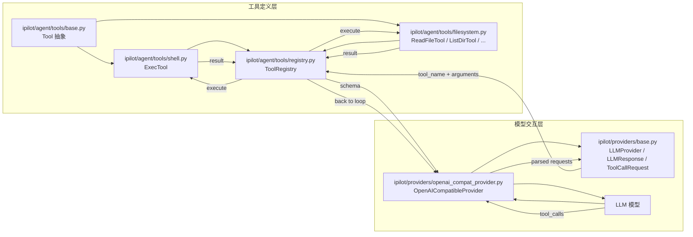

```mermaid
flowchart LR
  subgraph 定义层["工具定义层"]
    T["ipilot/agent/tools/base.py<br/>Tool 抽象"]
    S1["ipilot/agent/tools/shell.py<br/>ExecTool"]
    S2["ipilot/agent/tools/filesystem.py<br/>ReadFileTool / ListDirTool / ..."]
    R["ipilot/agent/tools/registry.py<br/>ToolRegistry"]

    T --> S1
    T --> S2
    S1 --> R
    S2 --> R
  end

  subgraph 模型层["模型交互层"]
    P["ipilot/providers/openai_compat_provider.py<br/>OpenAICompatibleProvider"]
    PB["ipilot/providers/base.py<br/>LLMProvider / LLMResponse / ToolCallRequest"]
    M["LLM 模型"]

    P --> M
    M --> P
    P --> PB
  end

  R -- schema --> P
  M -- tool_calls --> P
  P -- parsed requests --> PB
  PB -- tool_name + arguments --> R
  R -- execute --> S1
  R -- execute --> S2
  S1 -- result --> R
  S2 -- result --> R
  R -- back to loop --> P

```
