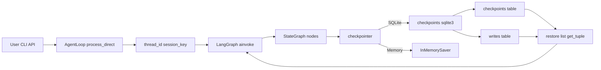
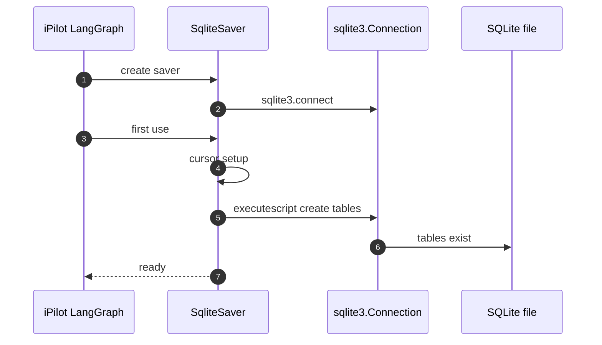
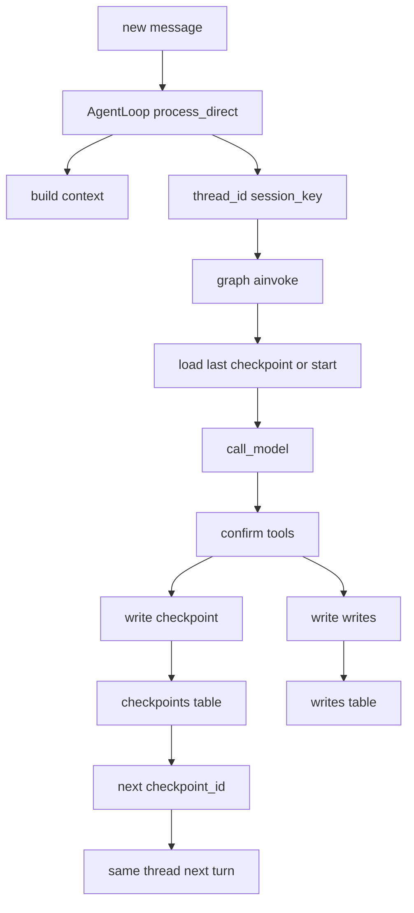
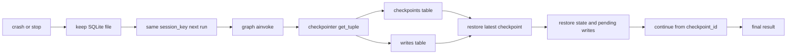
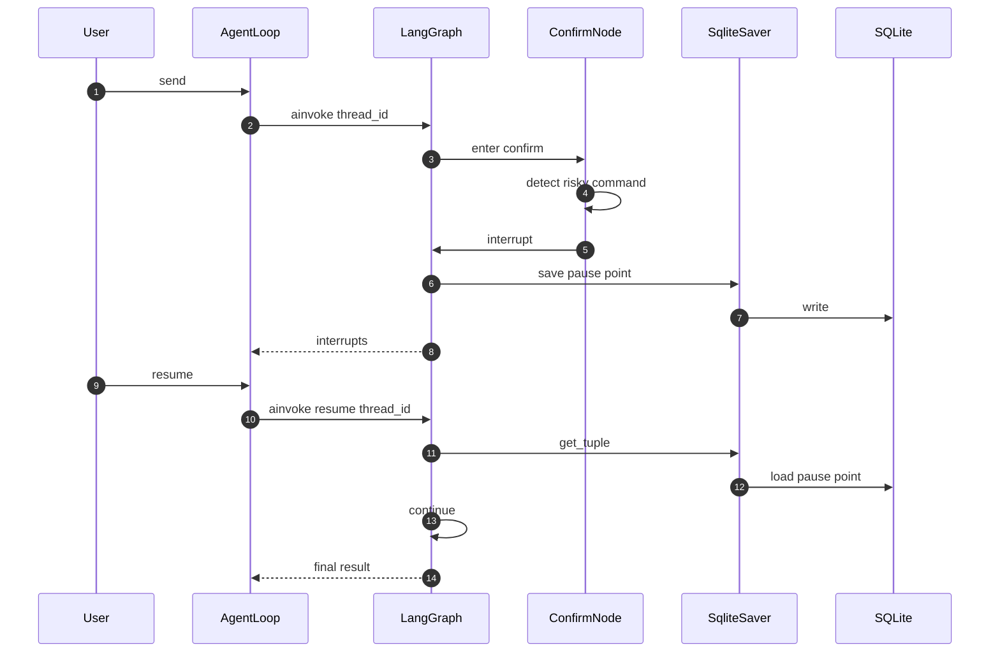

# LangGraph SQLite 持久化流程图

## 总览图

## 创表流程

## 更新流程

## 失败恢复流程

## 人工介入流程

## 备注

- 正式持久化入口使用 `SqliteSaver.from_conn_string(...)`。
- `session_key` 对应 LangGraph 的 `thread_id`。
- `InMemorySaver` 只适合实验入口。
